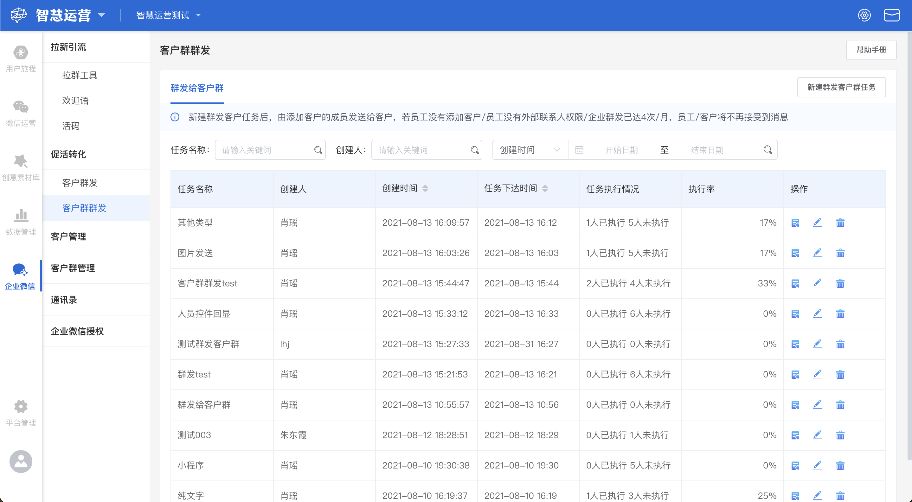
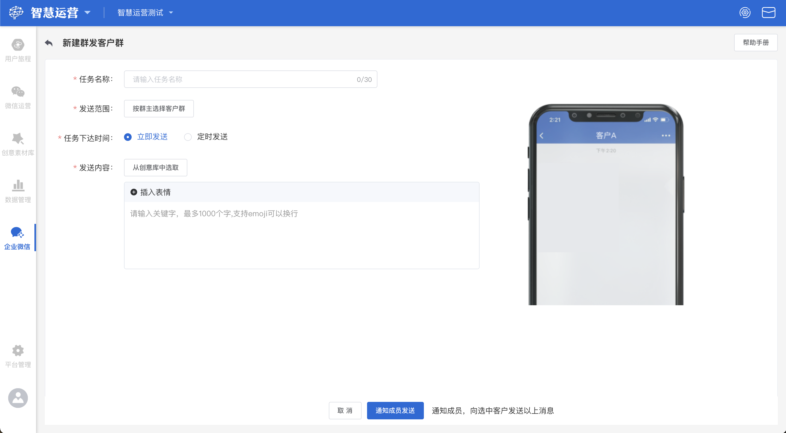
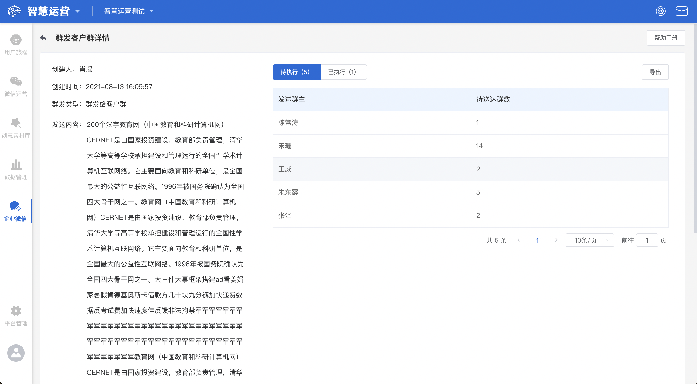
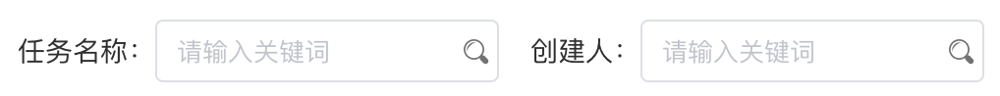
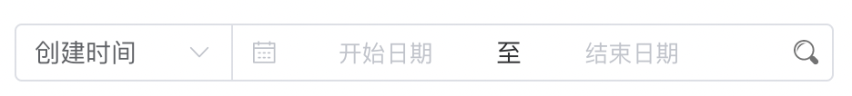

# 客户群群发

## 群发给客户群概览


任务名称：创建群发客户群任务时的任务名称

创建人：创建该群发客户群任务的创建人

创建时间：创建任务完成的时间

任务下达时间：新建群发给客户群任务时选择的任务下达时间

任务执行情况：当前任务的执行情况

执行率：当前任务的执行率


## 新建群发客户群任务

点击页面左上角**新建群发客户群任务**按钮，在新建群发客户群任务页面中共有以下四个编辑项及一个样式预览：


任务名称：该任务的名称

发送范围：需要发送的客户群范围，**按群主选择客户群**

任务下达时间：任务下达至群主的时间，有两个选项：1.立即发送：任务创建完成后，立刻通知群主进行发送；2.定时发送：任务创建完成后，在达到设置的日期时间点时，通知群主发送

发送内容：群主执行群发任务时，需要给客户群发送的内容。有两种添加方式：1.通过[创意库](../../creativity-material-library/creativity-library.md)选取添加；2.通过文本框编辑直接添加

样式预览（右侧）：1.根据左侧发送内容的添加，会按添加顺序出现在右侧预览区域；2.超出可视范围，可下拉查


编辑完成后，点击**通知成员发送**按钮，即可创建一个新的群发客户群任务

## 群发客户群任务操作

依次为**查看、编辑、删除**操作按钮

### 查看群发客户群任务详情

若想要查看某一群发客户群任务的详情时，找到该任务，点击该任务右侧的**查看**按钮，即可进入群发客户群任务详情页。在该页面可以分别查看未执行任务群主列表和已执行任务群主列表，对于未执行群主可惦记**提醒群主发送**按钮提醒群主尽快执行任务。

### 编辑群发客户群任务

若需要对某一群发客户群任务进行编辑时，点击该群发客户群任务右侧的**编辑**按钮，可以重新修改该群发客户群任务的内容


任务下达后不可编辑，下达前可编辑


### 删除群发客户群任务

若需要将某一群发客户群任务删除时，点击该群发客户群任务最右侧的**删除**按钮，可直接进行删除。

### 搜索群发客户群任务

在群发客户群任务的主页面，使用者可以通过任务名称搜索框和创建人搜索框对群发客户群任务进行搜索，在搜索框内输入关键词后键入回车键，群发客户群任务展示列表将根据输入的关键词展示搜索后符合条件的结果。如果搜索后页面展示暂无数据，说明没有任务名称与输入的关键词可以匹配。

### 通过时间进行筛选

在群发客户群任务列表的页面，使用者可以通过选择**任务下达时间**或**创建时间**进行筛选。

