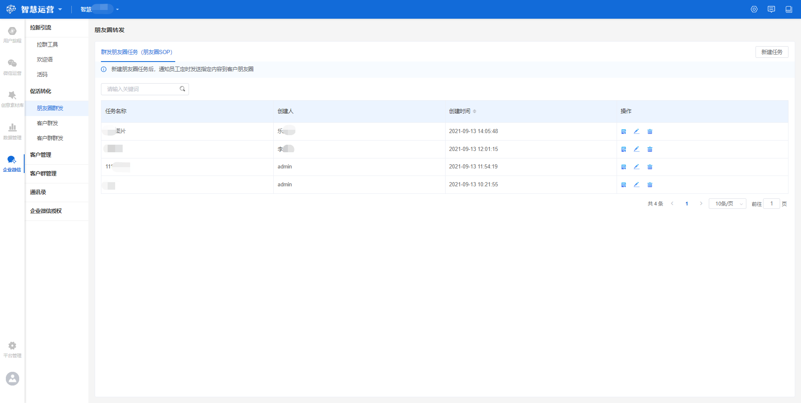
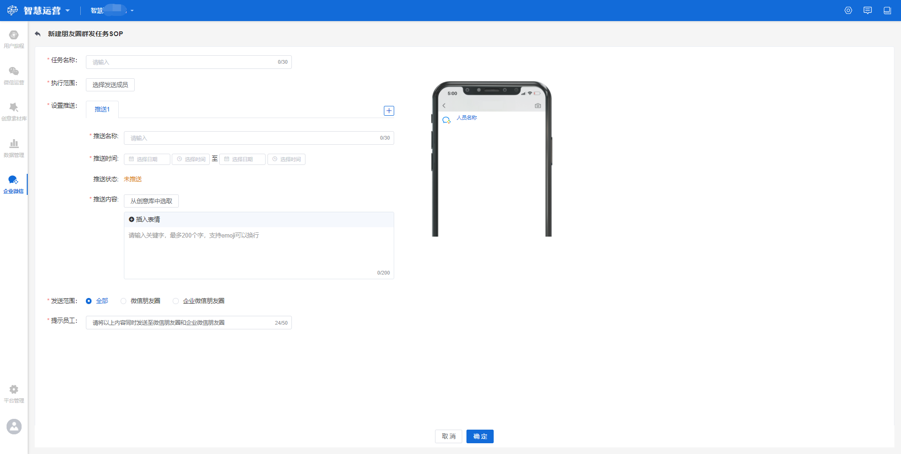
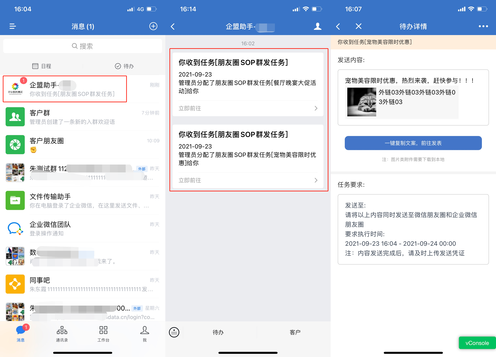
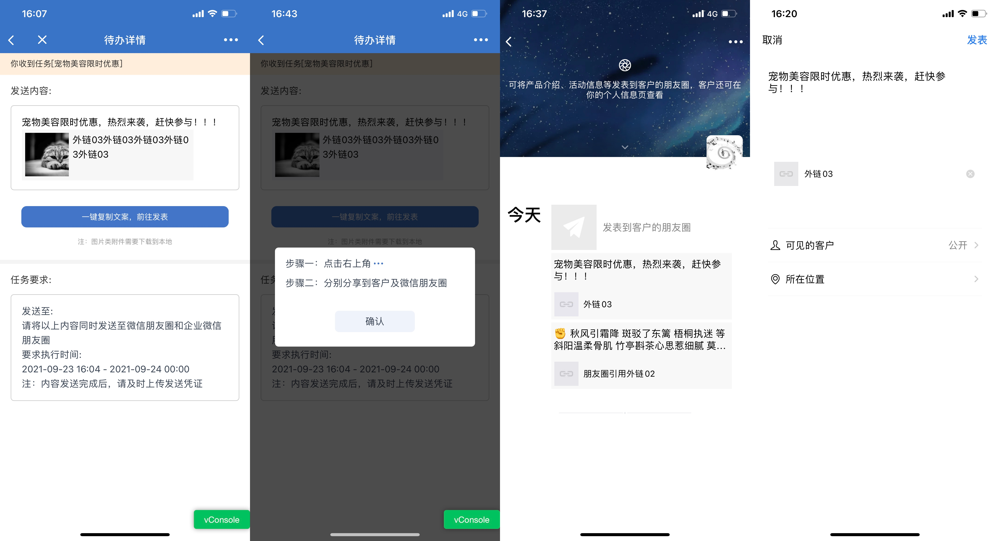
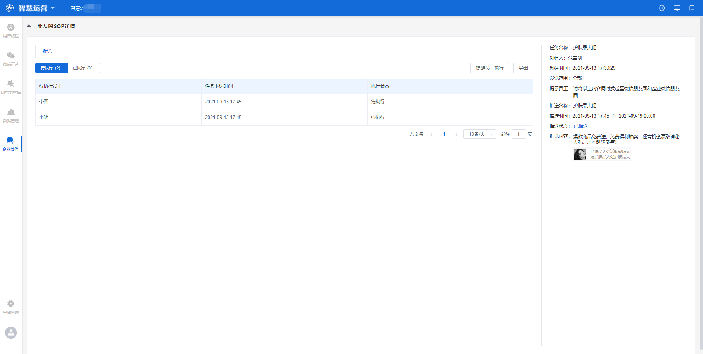
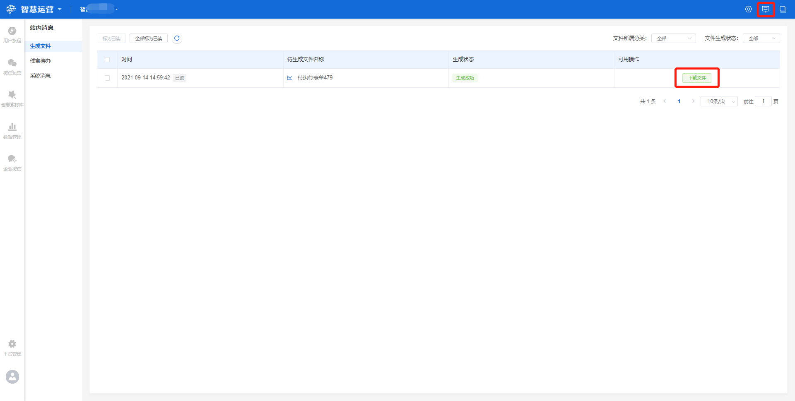
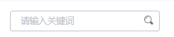

# 朋友圈群发

## 朋友圈群发任务

### 朋友圈群发任务概览

一站式朋友圈运营闭环，丰富多样的素材内容和呈现形式，通过新建群发任务可有效的提升触达到用户的内容质量，且可实时管控员工任务的完成情况。

操作步骤：点击**企业微信**进入到**促活转化**功能下的**朋友圈群发**页面。


新建朋友圈群发任务：管理员通过新建任务的形式将需要发表的内容下发给员工，员工收到后将内容复制/保存到本地，并发表到朋友圈，实现客户触达。

页面功能：创建好群发任务后会在此页展示，可以通过关键词搜索到，且支持查看详情、重新编辑、删除（详情可见**新建群发朋友圈任务操作**）。


### 新建朋友圈群发任务

操作步骤：在**朋友圈群发**页面（企业微信-促活转化-朋友圈群发），点击右上角**新建任务**，进入到如下页面，并填写相关内容。


任务名称：本次推送的活动名称_（最多可输入30个字）_

执行范围：选择本次活动需要转发朋友圈的员工_（最多可选100人）_

设置推送：推送到朋友圈的相关内容_（最多支持5条推送，每条填写内容均如下：）_

* 推送名称：推送到朋友圈的任务名称_（最多可输入30个字）_
* 推送时间：推送到朋友圈的任务时间_（不得早于当前时间）_
* 推送状态：已推送/未推送
* 推送内容：推送到朋友圈的具体内容，支持右侧实时预览_（最多200个字，支持中英文、数字、符号、微信表情）_
  * 支持以下推送形式：① 正文+图片_（最多可添加9张）_ ② 正文+外链_（最多1条）_

发送范围：微信朋友圈、企业微信朋友圈、全部_（企业微信和微信朋友圈）_

提示员工：默认提示**发送范围**对应内容，也可自定义编辑_（最多可输入50个字）_


以上信息全部填写完成后（如下图），点击**确定**，任务创建成功，员工会收到该任务。

.jpg>)

### 执行朋友圈群发任务

到达指定的推送时间，员工会在移动端企业微信上收到派发的任务，查看任务详情，然后按照任务要求发表，发表成功之后及时上传任务凭证，任务即算完成。

#### 查看任务详情

可查看管理员下发任务的内容和要求。


**查看路径一：**打开手机的企业微信 -- 点击**企盟助手**的任务消息 -- 查看收到的任务 -- 点击任务详情，即可看到发送内容和任务要求（_如下图：路径一_）

**查看路径二：**打开手机的企业微信 -- 点击工作台 -- 企盟助手 -- 点击查看所有，可以看到所有待办的任务，点击任务详情，即可看到发送内容和任务要求 （_如下图：路径二_）


.jpg>)

#### 发表任务

员工执行管理员下发的任务，任务类型有如下两种：


**类型一：纯文案型 **或 **文案+外链型**

操作步骤：直接点击**一键复制文案，前往发表** -- **确认**操作步骤 -- 粘贴文案到内容框 -- 发表（步骤同发表微信朋友圈一样）

**类型二：纯图片型 **或** 文案+图片型**

操作步骤：点击图片 -- 长按图片保存到本地 -- 点击**一键复制文案，前往发表** -- **确认**并按步骤操作 -- 点击右上角  -- 转发朋友圈（按任务要求) -- 粘贴文案到内容框并添加保存的图片 -- 发表（步骤同发表微信朋友圈一样）


.jpg>)

#### 上传凭证

员工发表任务之后截图，上传凭证，即可完成任务。


操作步骤：打开手机的企业微信 -- 点击工作台 -- 企盟助手 -- 找到该任务 -- 点击**上传发送凭证** -- 点击上传添加图片 -- 确认


.jpg>)

### 新建朋友圈群发任务操作

\
依次为**查看、编辑、删除**操作按钮

#### 查看群发朋友圈任务详情

若想要查看任务详情，可通过搜索找到该任务，点击该任务右侧的**查看**按钮，即可进入任务详情页。在该页面可以查看员工任务的执行情况且支持导出，还可以提醒员工去执行。


待执行：点击**“提醒员工执行”**，就可以提醒员工执行任务了，也可以**导出**为**Excel**明细查看

已执行：已执行的，可查看员工上传的**“执行凭证”**（已执行-执行凭证-查看），也支持**导出**

导出：导出的明细可以在**“消息”**里面查看导出进度**，**且可以**下载**导出的**Excel**明细（如下图）


#### 编辑群发朋友圈任务

若需要对某一群发朋友圈任务进行编辑时，点击该群发朋友圈任务右侧的**编辑**按钮，可以重新修改该群发朋友圈任务的内容


任务下达后不可编辑，下达前可编辑


#### 删除群发朋友圈任务

若需要将某一群发朋友圈任务删除时，点击该群发朋友圈任务最右侧的**删除**按钮，可直接进行删除。

#### 搜索群发朋友圈任务

若需要查找某一群发朋友圈任务，可以通过**关键词**（任务名称、创建人）搜索。

