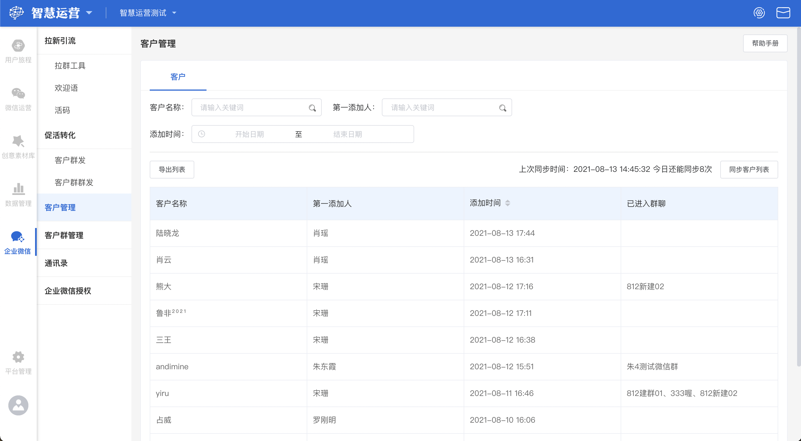
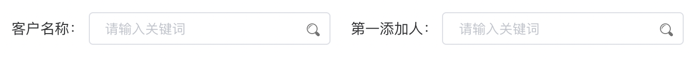
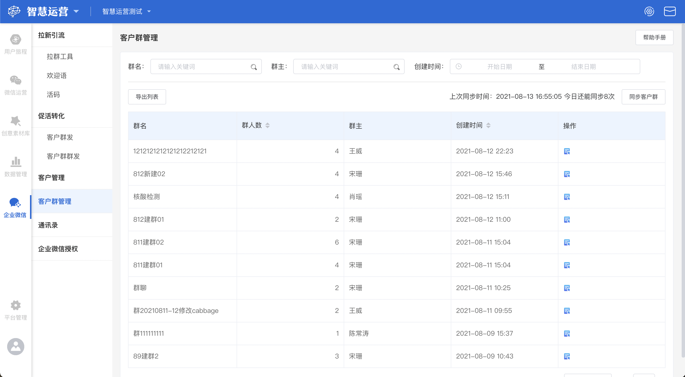

# 客户管理

## 客户管理

### 客户管理概览

客户管理模块主要便于使用者查看企业微信外部客户信息

企业微信外部客户列表界面中共存在**客户名称，第一添加人，添加时间，已进入群聊四**个字段，各字段的含义如下：


客户名称：企业微信外部客户的名称

第一添加人：第一个添加该用户的员工，当第一个员工离职有，被分配的员工记为第一添加人

添加时间：企业微信外部首次添加员工为好友的时间，客户被重新分配后，则为最新分配的员工添加时间

已进入群聊：企业微信外部客户已加入的群聊名称


### 客户管理操作

#### 搜索客户

在客户管理的主页面，使用者可以通过**客户名称搜索框、第一添加人搜索框**对客户进行搜索，在搜索框内输入关键词后键入回车键，客户展示列表将根据输入的关键词展示搜索后符合条件的结果。如果搜索后页面展示暂无数据，说明没有客户与输入的关键词可以匹配。

#### 添加时间范围选择

点击**添加时间**展示区的时间范围选择器，可以选择查询的数据时间范围。

#### 导出列表

若需要对某一批客户信息进行导出时，先根据自己的需求将需要导出的客户筛选出来，点击列表左上方的**导出列表**按钮，就可以将这部分客户信息以Excel文件的形式下载至电脑本地。

#### 同步客户信息

若想要更新企业微信的外部客户信息，点击客户信息列表上方的**同步客户列表**按钮；即可将企业微信外部的客户信息更新同步至客户管理列表。


每天最多可更新8次


## 客户群管理

### 客户群管理概览  

客户群管理模块主要是便于系统管理员查看企业微信客户群信息。

客户列表界面中共存在**群名，群人数，群主，创建时间**四个字段，各字段的含义如下：


群名：企业微信客户群当前的名称

群人数：企业微信客户群当前的人数

群主：企业微信客户群当前的群主名称

创建时间：企业微信客户群的创建时间


### 客户群管理操作

#### 查看客户群详情

\
若想查看某一客户群的详情时，找到这条客户群数据，点击其右侧的**查看详情**按钮，即可进入客户群详情页。

#### 搜索客户群

在客户群管理的主页面，使用者可以通过**群名搜索框、群主搜索框**对客户群进行搜索，在搜索框内输入关键词后键入回车键，客户群展示列表将根据输入的关键词展示搜索后符合条件的结果。如果搜索后页面展示暂无数据，说明没有客户群与输入的关键词可以匹配。

#### 创建时间范围选择

点击**创建时间**展示区的时间范围选择器，可以选择查询的数据时间范围。

#### 导出列表

若需要对某一批客户群信息进行导出时，先根据自己的需求将需要导出的客户群筛选出来，点击列表左上方的**导出列表**按钮，就可以将这部分客户群信息以Excel文件的形式下载至电脑本地。

#### 同步客户群信息

若想要更新企业微信上的客户群信息，点击客户群信息列表上方的**同步客户列表**按钮；即可将企业微信内的客户群信息更新同步至客户群管理列表。
