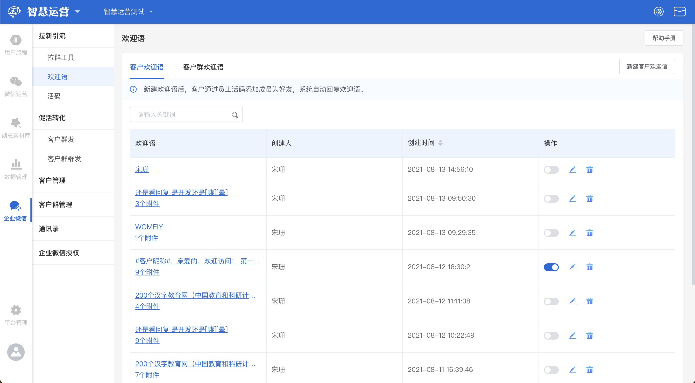
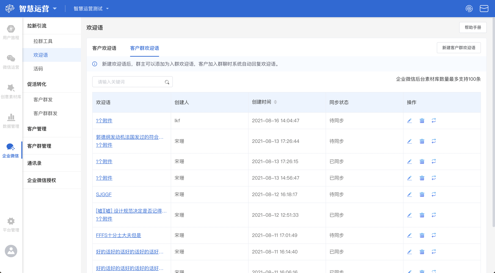
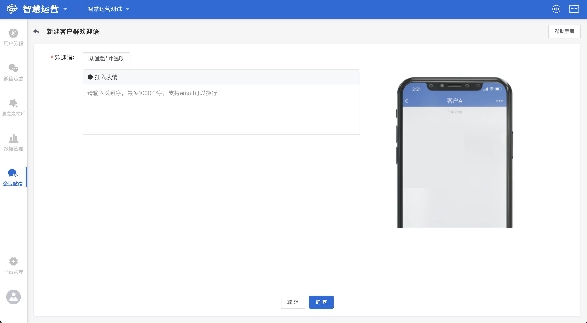

# 欢迎语

## 客户欢迎语

### 客户欢迎语概览

功能说明：客户通过员工二维码添加为好友，系统自动回复欢迎语。以达到和用户互动，不至于冷场。

### 新建客户欢迎语


客户欢迎语：欢迎语又称新好友自动回复，此处可添加文字、图片、图文链接及小程序，客户来了不用担心冷场。有两种添加方式：1.通过[创意库](../../creativity-material-library/creativity-library.md)选取添加；2.通过文本框编辑直接添加

样式预览（右侧）：1.根据左侧客户欢迎语的添加，会按添加顺序出现在右侧预览区域；2.超出可视范围，可下拉查看


编辑完成后，点击**确定**按钮，即可创建一个新的客户欢迎语。


如果企业在企业微信后台为相关成员配置了可用的欢迎语，使用第三方系统配置欢迎语，则均不起效，推送的还是企业微信官方的。


### 客户欢迎语操作

依次为**客户欢迎语开关、编辑、删除**操作按钮

#### 客户欢迎语开关

若想要开启（或关闭）某一客户欢迎语时，找到该欢迎语，将该客户欢迎语右侧的**开关**按钮调整为开启（或关闭）状态即可


欢迎语只能开启一个


#### 编辑客户欢迎语

若需要对某一客户欢迎语进行编辑时，点击该客户欢迎语右侧的**编辑**按钮，可以重新修改该客户欢迎语的内容

#### 删除客户欢迎语

若需要将某一客户欢迎语删除时，点击该客户欢迎语最右侧的**删除**按钮，可直接进行删除

#### 搜索客户欢迎语

.png>)

若要搜索具体某个客户欢迎语时，在搜索框内输入该欢客户迎语的创建人或客户欢迎语内容后键入回车，展示界面将实时展示搜索后得到的结果

## 客户群欢迎语

### 客户群欢迎语概览

功能说明：管理员新建客户群欢迎语后，群主可以添加为入群欢迎语，客户加入群聊时系统自动回复欢迎语。


管理员：在智慧运营配置客户群欢迎语，同步至企业微信群欢迎语素材

群主：客户群群主在企业微信手机端选择客户群欢迎语素材

客户：客户入群时，会收到由系统自动发送入群欢迎语



一个群只能设置一个欢迎语，这取决于群主的选择。


### 新建客户群欢迎语


客户群欢迎语：客户加入群聊时，群主自动回复的内容。此处可添加文字、图片、图文链接及小程序，客户来了不用担心冷场。有两种添加方式：1.通过[创意库](../../creativity-material-library/creativity-library.md)选取添加；2.通过文本框编辑直接添加

样式预览（右侧）：1.根据左侧客户群欢迎语的添加，会按添加顺序出现在右侧预览区域；2.超出可视范围，可下拉查看


### 客户群欢迎语列表操作

依次为编辑、删除、同步操作按钮

#### 编辑客户群欢迎语

若需要对某一客户群欢迎语进行编辑时，点击该客户群欢迎语右侧的**编辑**按钮，可以重新修改该客户群欢迎语的内容

#### 删除客户群欢迎语

若需要将某一客户群欢迎语删除时，点击该客户群欢迎语右侧的**删除**按钮，可直接进行删除

#### 同步客户群欢迎语

若需要将某一客户群欢迎语同步至企业微信群欢迎语素材库时，点击该客户群欢迎语最右侧的**同步**按钮，可将该客户群欢迎语同步至企业微信后台素材库内


企业微信后台素材库数量最多支持100条


#### 搜索客户群欢迎语

.png>)

若要搜索具体某个客户群欢迎语时，在搜索框内输入该客户群欢迎语的创建人或客户群欢迎语内容后键入回车，展示界面将实时展示搜索后得到的结果
