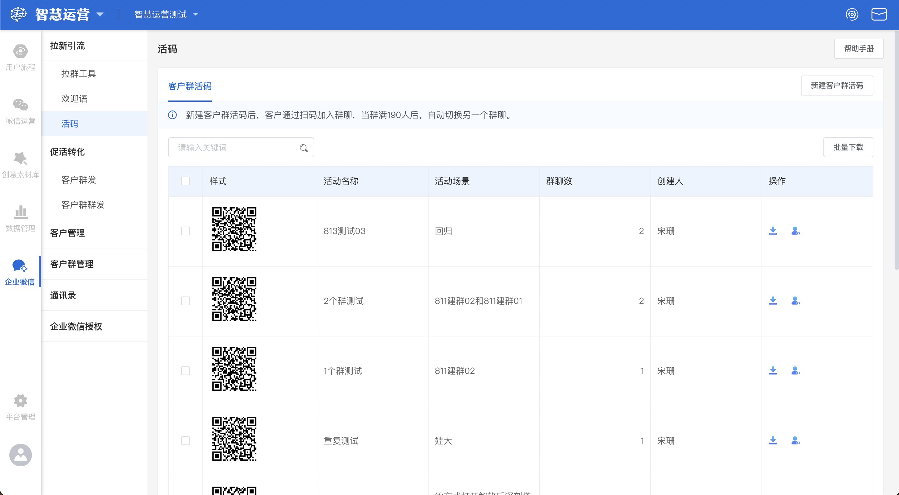
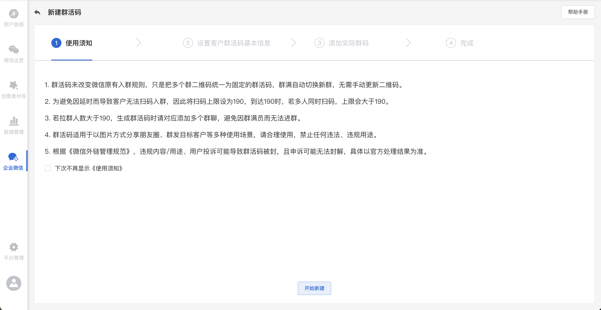
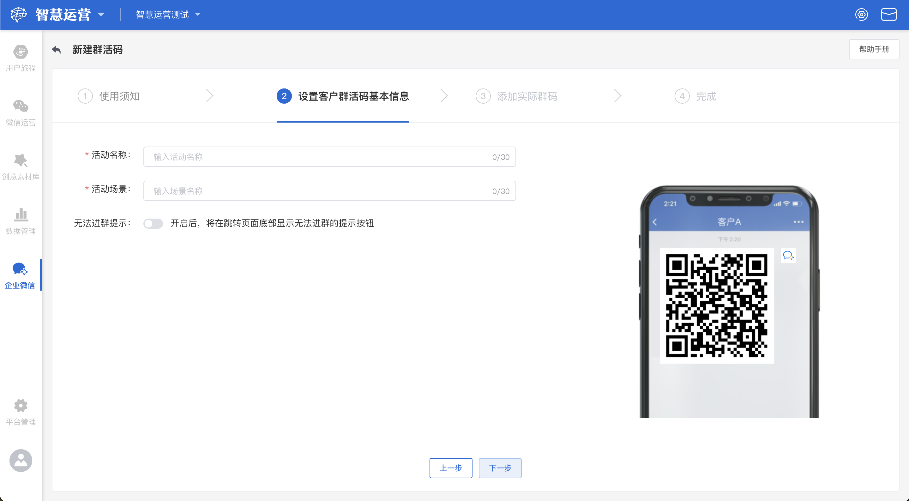
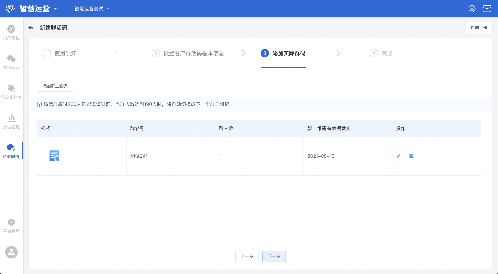
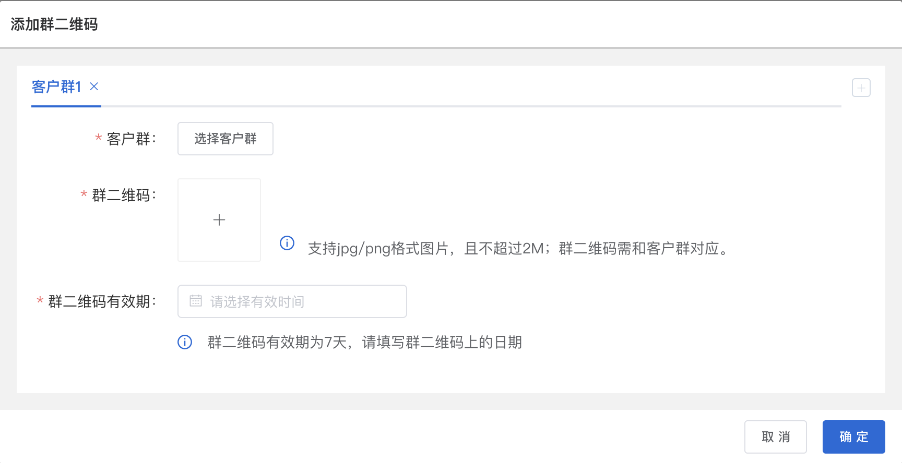
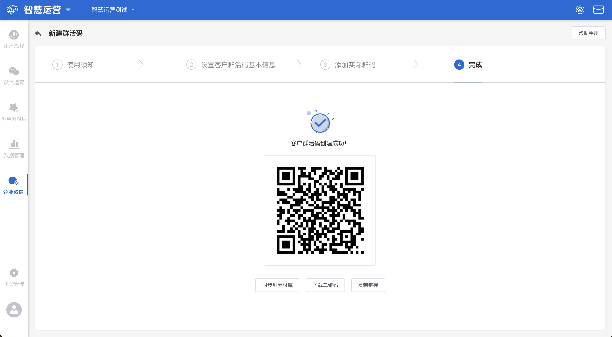

# 活码

## 客户群活码概览

群活码突破群扫码限制:新建客户群活码后，客户通过扫码加入群聊，当群满190人后，自动切换另一个群聊

快速引流：解决超过200人无法扫码入群与群码7天失效难题，群二维码随时更新，智能切换，对外宣传二维码不变。

防止重复进群/加好友，提升用户有效性：用户扫码获取二维码后，无法再通过该活码进入其他群或添加其他客服，提升用户有效性

## 新建群活码

点击页面右上角**新建群活码**按钮，在新建群活码页面中共有以下四个步骤：

### 步骤1：阅读群活码使用须知

### 步骤2：主要用于设置群活码基础信息，便于后续查找。

设置客户群活码基本信息，该步骤共有以下三个编辑项：


活动名称：该群活码对应的活动名称

活动场景：该群活码对应的活动场景

 无法进群提示开关：开启之后，需要上传客服二维码


### 步骤3：添加实际群码 

群二维码列表共有以下几个字段：


群二维码：群二维码样式

群名称：添加群聊时选择的群名称

群人数：该群当前人数

群二维码有效期截止：二维码的有效期截止日期


#### 添加群二维码

点击页面右上角**添加群二维码**按钮，在添加群二维码弹窗中共有以下三个编辑项：


选择客户群：只能选择企业微信下的已有客户群

群二维码：群二维码需与所选的客户群对应，否则会导致客户扫码后不能进群

群二维码有效期：选择群二维码上的截止日期


#### 群二维码操作

依次为**编辑、删除**操作按钮

#### 编辑群二维码

若需要将编辑某一群二维码时，点击该群二维码右侧的**编辑**按钮，可以重新修改该群二维码的内容

#### 删除群二维码

若需要将某一群二维码删除时，点击该群二维码最右侧的**删除**按钮，可直接进行删除

### 步骤4：完成

当完成前面3个步骤的填写后会进入客户群活码创建成功页，该页面共有三个操作：


同步到素材库：将群活码同步至企业微信素材库

下载二维码：将该群二维码下载至电脑本地

复制链接：复制该群二维码链接


## 客户群活码操作

依次为**下载群活码、管理群聊**操作按钮

### 下载客户群活码

若需要下载某一群活码时，点击该客户群活码右侧的**下载**按钮，可以该群活码下载至电脑本地。

### 管理群聊

若需要管理某一客户群聊时，点击该客户群活码右侧的**管理群聊**按钮，即可进入管理群聊页面。

### 搜索群活码

.png>)

若要搜索具体某个客户群活码时，在搜索框内输入该客户群活码的活动名称、活动场景、创建人后键入回车，展示界面将实时展示搜索后得到的结果
