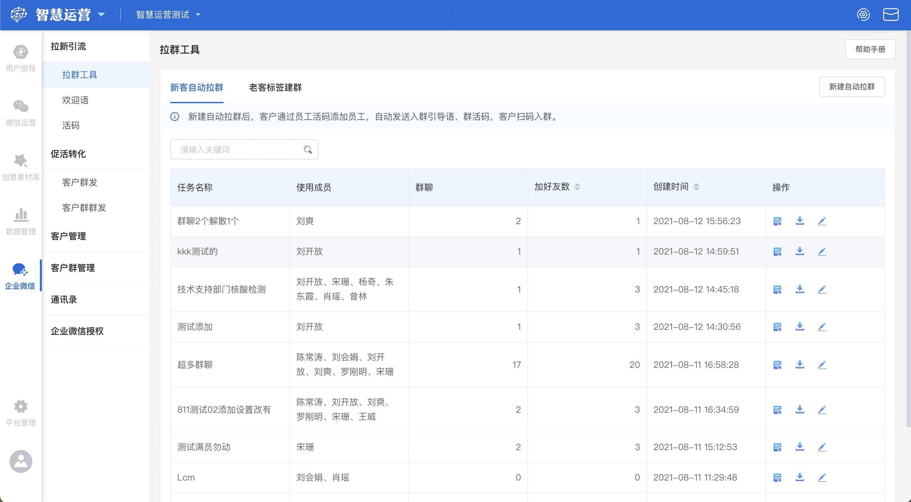
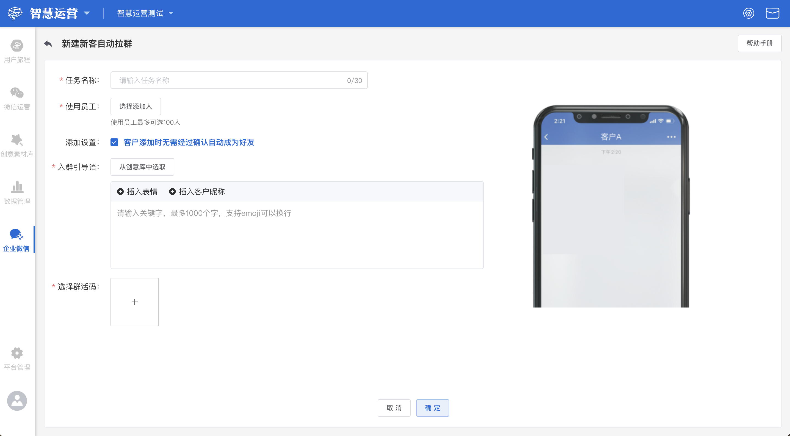
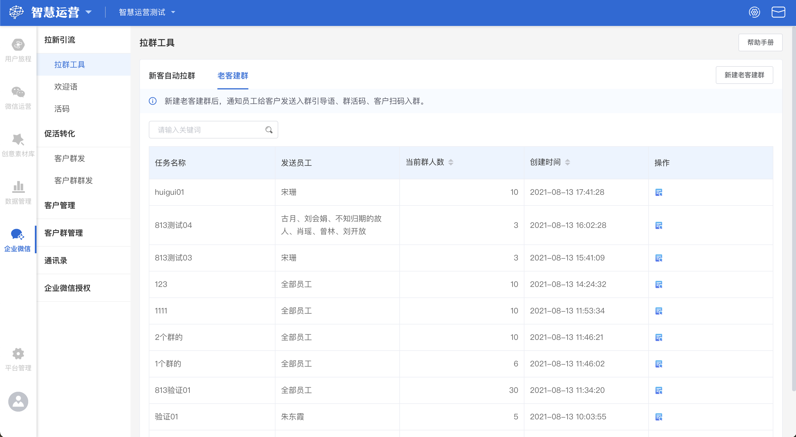
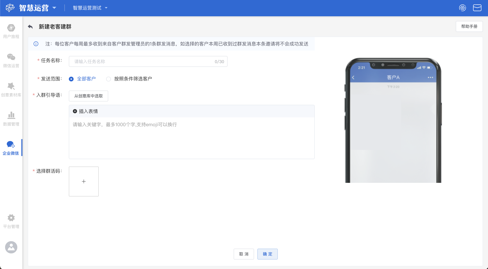
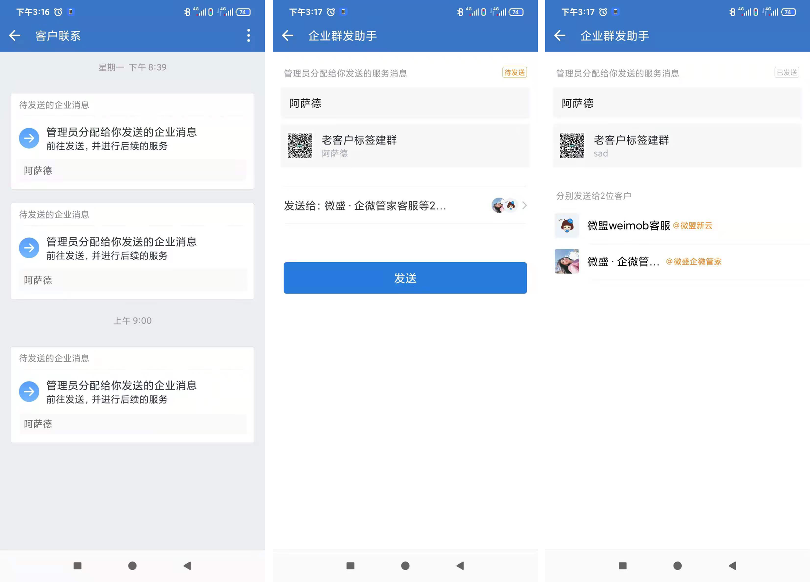

# 拉新工具

## 新客自动拉群

### 新客自动拉群概览

新客自动拉群模块主要是便于客户通过扫描员工活码加好友后，系统自动为客户发送入群指引。


新客户自动拉群：通过选择使用成员，生成对应的员工活码，客户扫描活码添加员工后，员工自动推送入群引导语和群活码，客户可扫码入群。

使用员工：通过在企业组织架构里选择使用人员，生成对应的员工活码，客户扫码添加对应员工为好友。员工最多可选100人。


### 新建新客自动拉群

点击页面右上角**新建自动拉群**按钮，在新建自动拉群页面中共有以下五个编辑项：


任务名称：该任务的名称

使用员工：使用该拉群任务的员工

添加设置：设置客户扫码添加时，是否需要经过确认自动成为好友

入群引导语：客户扫码添加好友成功时，系统自动发送给客户的入群引导语。有两种添加方式：1.通过[创意库选取](../../creativity-material-library/creativity-library.md)添加；2.通过文本框编辑直接添加

选择群活码：选择设置好的[群活码](huo-ma.md)


编辑完成后，点击**确定**按钮，即可创建一个新的新客拉群任务。


字段前带`*`为必填项，点击确定时系统会检测所有必填项是否已填写完整。


### 新客自动拉群任务操作

依次为查看新客拉群详情、下载群活码、修改新客拉群规则操作按钮

#### 查看新客拉群详情

若想要查看某一新客拉群任务的详情时，找到该任务，点击该任务右侧的**查看新客拉群详情**按钮，即可进入新客拉群任务详情页。

#### 下载群活码

若需要下载某一任务的群活码时，点击该任务最右侧的**下载**按钮，即可将该任务的群活码下载至电脑本地

#### 修改新客拉群规则

点击某一任务右侧的**修改新客拉群规则**按钮，可以重新设置该任务的**任务名称，使用员工，添加设置，入群引导语，群活码**信息

#### 搜索任务

若要搜索具体某个新客拉群任务时，在搜索框内输入该任务名称或成员名称后键入回车，展示界面将实时展示搜索后得到的结果

## 老客建群

### 老客建群概览

新建老客建群后，通知员工给客户发送入群引导语、群活码、客户扫码入群。

### 新建老客建群

点击页面右上角**新建老客建群**按钮，在新建自动拉群页面中共有以下五个编辑项：


任务名称：该任务的名称

发送范围：选择该任务所要发送的客户范围，有两种选择：1.全部用户：当前企业微信全部用户；2.按照条件筛选客户：「选择添加人」执行该任务的员工；「添加时间」 员工添加客户的时间

入群引导语：员工执行老客建群任务时，系统发送给客户的入群引导语，有两种添加方式：1.从[创意库](../../creativity-material-library/creativity-library.md)中选择，点击【从创意库中选取】打开创意选择器，可选择已经创建好的纯文本、图片、外链创意、小程序创意类型；2.通过文本框直接编辑添加

选择群活码：选择设置好的[群活码](huo-ma.md)

发送方式：任务下发至员工时的方式，有两种方式可以选择：1.企业群发：设置老客建群-添加客户的员工收到群发消息提醒-群发引导语、群活码-客户扫码入群；2.个人群发：设置老客户建群-添加客户的员工收到群发消息提醒、加入待办-手动群发引导语、群活码-客户扫码入群。


编辑完成后，点击**通知员工发送**按钮，即可创建一个新的老客建群任务，同时系统会通知员工，向选中的客户发送以上信息。


字段前带`*`为必填项，点击确定时系统会检测所有必填项是否已填写完整。


### 老客建群任务操作

.png>)

**查看详情**

若想要查看某一老客建群任务的详情时，找到该任务，点击该任务右侧的**查看详情**按钮，即可进入老客建群任务详情页面。

#### 搜索任务

.png>)

若要搜索具体某个老客建群任务时，在搜索框内输入该任务名称后键入回车，展示界面将实时展示搜索后得到的结果
