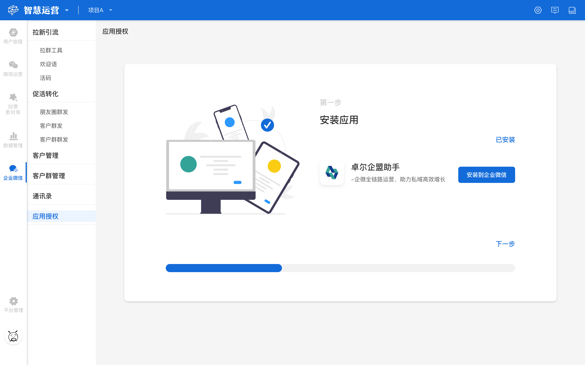
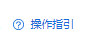
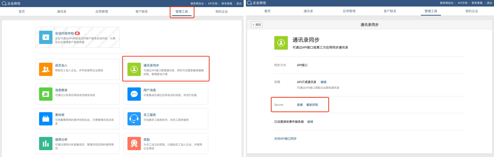
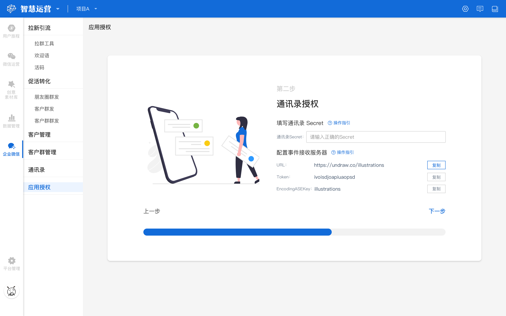
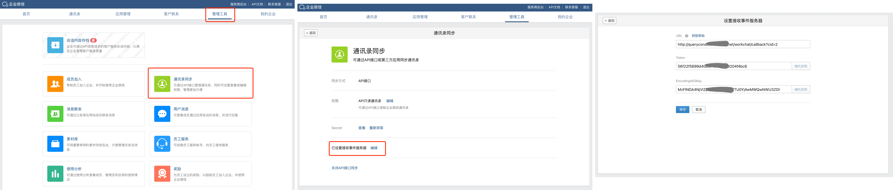
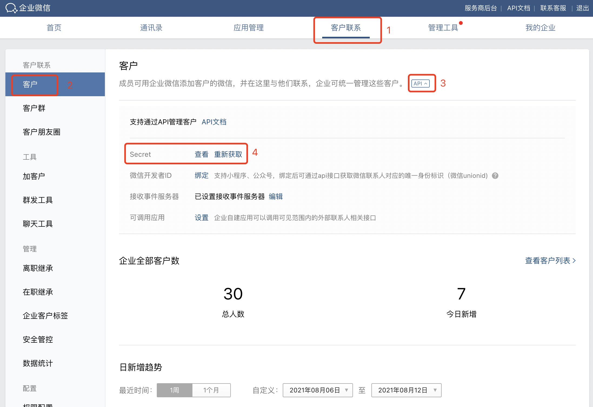
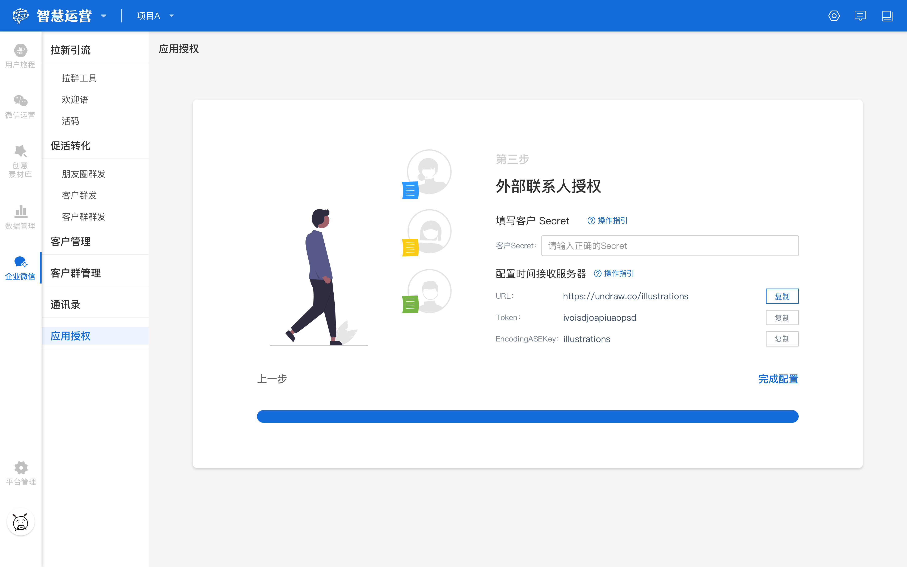
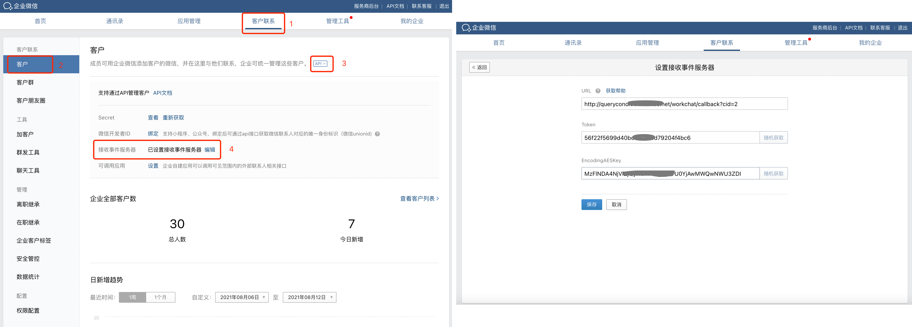

# 企微授权管理

## 企业微信授权概览

提供企业微信授权管理的功能，用于对企业微信与本平台绑定的授权和管理。

点击工作台左侧功能导航区**企业微信-企业微信授权**，进入**应用授权**界面。

.jpg)

## 安装应用

首先您需要点击**【安装到企业微信】**，其次由管理员用微信/企业微信扫码，在跳转的页面确认授权并添加之后，3s左右会返回到应用安装页面，且右上角显示“已安装”（如下图：安装应用），然后可进行下一步操作。

## 通讯录授权

点击**下一步**，进入到通讯录授权，填写**通讯录Secret**：


**通讯录Secret**可以在企业微信管理后台查看确认，登录地址：[https://work.weixin.qq.com/](https://work.weixin.qq.com/wework_admin/frame#customer/analysis)****


点击** **** **，可查看填写规则及所在位置：


填写规则：与授权企业微信的通讯录管理Secret保持一致。

查看位置：登录企业微信管理后台----管理工具--通讯录同步页面中「Secret」字段。


填写完通讯录Secret，系统会自动生成**URL、Token、EncodingAESKey**（如下图：通讯录授权）**，**您需要将这些信息复制然后回填至企业微信管理后台（见操作指引）。

点击** **** **，可查看企业微信后台**URL、Token、EncodingAESKey**需要回填的位置：


查看位置：管理工具--通讯录同步--设置接收事件服务器(需要管理员在手机端企业微信授权)。


在企微后台填完以上信息，保存设置，您可以返回系统进行下一步操作。

##  外部联系人授权

点击下一步，进入到**外部联系人授权**，填写**客户Secret**：


**客户Secret**可以在企业微信管理后台查看确认，登录地址：[https://work.weixin.qq.com/](https://work.weixin.qq.com/wework_admin/frame#customer/analysis)****


点击** **** **，可查看填写规则及**客户Secret**所在位置：


填写规则：与授权企业微信的外部联系人Secret保持一致。

查看位置：登录企业微信管理后台----客户联系--客户页面--api中「Secret」字段。


\
填写完客户Secret，系统会自动生成**URL、Token、EncodingAESKey**（如下图：外部联系人授权）**，**您需要将这些信息复制然后回填至企业微信管理后台（见操作指引）。

点击** **** **，可查看企业微信后台**URL、Token、EncodingAESKey**需要回填的位置：


查看位置： 客户联系--客户--API--设置接收事件服务器(需要管理员在手机端企业微信授权)。


在企微后台填完以上信息，保存设置，然后返回系统点击【**完成配置**】，即可使用企业微信助手了。

##

###
