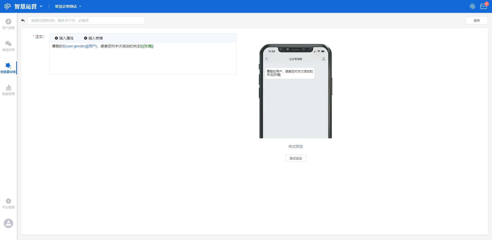
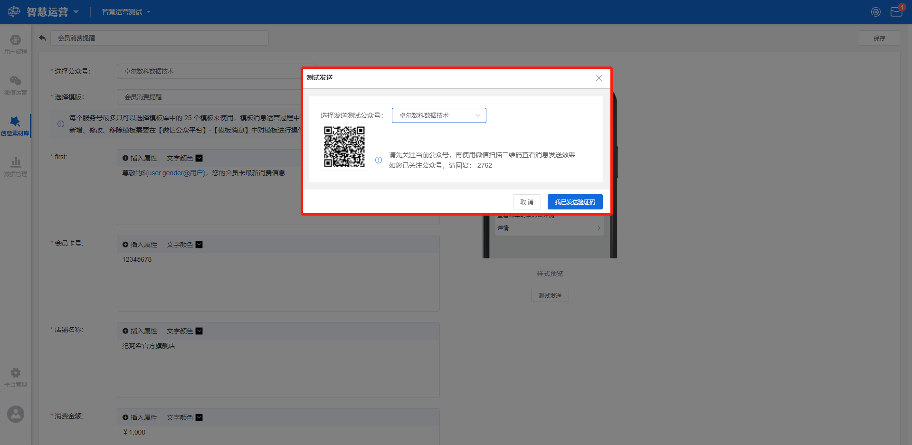

# 创意库

## 功能描述

由素材组合文字构成。

创意库主要在以下场景中使用：

* 在用户旅程中使用；
* 在微信运营中使用。

## 创意库界面概览

点击工作台左侧功能导航区**创意素材库**按钮，进入创意素材库界面，即展示创意列表。支持按创意类型筛选、输入关键词按名称搜索。

界面主要显示创意列表，包括创意内容、创意信息和可用操作。

## 新建创意

点击**新建创意**按钮展现模态窗，选择需要创建的创意类型，包括**短信、Webhook文本、会话菜单、外部链接、小程序、纯文字、模板消息**7种类型。

### 短信

通过给用户手机号发送短信的方式触达用户。

在模态窗选择短信，进入短信创意创建界面。需添加创意名称和选择短信通道。

> 创意名称：该创意的名称，自定义；
>
> 短信通道：在下拉框选择相应的通道和账号，备选项为在[触达通道配置-短信](../set-center/reach-channel-configuration.md#duan-xin)中提前设置的通道和账号。可点击右侧**刷新**按钮刷新短信通道数据。

#### 短信内容设置

选择完短信通道则展现短信内容设置区，根据不同的短信通道，短信内容设置分有模板ID和无模板ID两种情况。



有模板ID时，需输入对应的短信模板ID并设置变量，设置变量时需添加模板变量名、选择变量属性、设置默认值。

> 模板变量名：设置该模板变量的名称，自定义；
>
> 选择变量属性：在下拉框中选择该模板变量对应的用户属性；
>
> 默认值：设置当属性值为空时的替代值。


例如，设置模板变量为性别，选择性别对应的用户属性，当该属性值为空时，设置默认值“用户”，则在发送信息时，但性别属性有值时，信息显示“男士”或者“女士”，当属性值为空时，信息显示“用户”。


可点击**添加变量模板**按钮，添加变量设置输入选项，设置多条变量模板，设置方法同上。




无模板ID时，需登录至对应短信平台，将已审核的模板复制至短信内容编辑框内编辑即可。

可在变量处插入属性，点击插入属性按钮，在弹窗中选择用户属性，并设置属性为空时的默认值，点击**确定**保存当前设置。若点击**取消**则不保存，返回原短信创意创建界面。




#### 测试发送

设置完成之后点击界面右侧**测试发送**按钮，展现测试发送弹窗，输入接受信息的手机号并点击**确定**，即可发送测试信息。点击**取消**则不发送，返回原短信创意创建界面。

点击界面右上角**保存**按钮，可保存当前设置，所创建的创意将在创意列表中显示；点击**返回**则不保存，返回创意素材库界面。

### Webhook文本

通过对接您的自有平台，由您自定义选择后续的触达用户方式。

在模态窗选择Webhook文本，进入Webhook文本创意创建界面。需在下拉框选择触达通道，备选项为在[触达通道配置-webhook](../set-center/reach-channel-configuration.md#webhook)中提前设置好的通道名称。

#### 模板参数赋值

选择完触达通道则展现Webhook内容设置区，显示[触达通道配置-webhook](../set-center/reach-channel-configuration.md#webhook)中设置的用户属性，同时需要对触达通道配置中设置的模板参数进行赋值。

根据设置参数的类型不同，赋值规则也不同，模板参数包括**文本、字符串、数值-小数、数值-整数、数值-百分比、日期、图片**7种类型，各类型赋值规则如下：

> 文本类参数：输入文本类的内容，并支持插入用户属性，允许输入中文、英文、数字、符号；
>
>  字符串类参数：允许输入中文、英文、数字、符号； 
>
> 数值类参数：只允许输入数值，分为整数、小数和百分比类型，根据不同的类型进行小数点后输入的约束； 
>
> 日期类参数：在时间选择器中选择，可精确至分钟； 
>
> 图片类参数：点击选择图片素材，弹出创意素材选择器，对图片进行选择。

#### 测试发送

设置完成之后点击界面右侧**测试发送**按钮，展现测试发送弹窗，输入接受信息的sendId并点击确定，即可发送测试信息。点击**取消**则不发送，返回原Webhook创意创建界面。


sendId：测试发送时接收信息的用户属性的值，如设置通道时选择发送ID为手机号，则此处填写需要接收测试信息的手机号码，允许输入中文、英文、数字、符号。


点击界面右上角**保存**按钮，可保存当前设置，所创建的创意将在创意列表中显示；点击**返回**则不保存，返回创意素材库界面。

### 会话菜单

通过在微信公众号给用户发送会话菜单的方式触达用户。

在模态窗选择会话菜单，进入会话菜单创意创建界面。需在下拉框选择需要创建会话菜单创意的公众号名称（备选项为所有经过授权的公众号名称），并在左侧编辑框自定义添加所创建创意的名称。

#### 创建首条会话菜单

在该界面点击**增加会话菜单**或**编辑**按钮，均展示首条会话菜单创建弹窗。

创建首条会话菜单时需设置**开头语、菜单选项、结束语**。其中，开头语和结束语为非必填项，可选择不添加；菜单选项为必填项，必须添加。

> 开头语：设置本条消息的开头语，为自定义，可插入用户属性和表情；
>
> 菜单选项：设置用于描述供用户选择点击的链接的文字，可点击**添加链接文字**按钮增加多条链接文字，点击编辑框后面的**删除**按钮删除本条链接文字；
>
> 结束语：设置本条消息的结束语，为自定义，可插入用户属性和表情。

设置完成之后点击**保存**按钮，保存当前设置，设置的首条消息将在会话菜单创意创建界面显示，在首条消息右侧支持编辑和清空操作。

> 编辑：点击进入首条会话菜单创建弹窗，对当前创建的首条消息进行编辑和修改；
>
> 清空：点击则清空当前创建的首条消息相关的所有内容。

#### 创建子级会话菜单

设置完首条会话菜单之后，界面将显示与设置的**菜单选项**对应的子级菜单，设置了多少条菜单选项，则显示几个子级菜单。

在子级菜单处点击增加会话菜单按钮，展现下拉框选择需要添加会话菜单的消息类型，包括**文字消息、图片消息、菜单会话、微信图文、外部链接、微信小程序**6种类型，各类型操作方法如下：

> 文字消息：点击弹出纯文本编辑弹窗，需输入文本内容，可插入属性和表情。点击**保存**按钮保存当前设置，点击**取消**按钮不保存，返回原界面；
>
> 图片消息：点击弹出创意素材选择器进行选择；
>
> 菜单会话：点击选择新建菜单会话或者选择菜单会话，点击新建菜单会话则展现菜单会话创建弹窗，设置方式同首条会话菜单创建；点击选择菜单会话则弹出创意素材选择器进行选择；
>
> 微信图文：点击弹出创意素材选择器进行选择；
>
> 外部链接：点击弹出创意素材选择器进行选择；
>
> 微信小程序：点击弹出创意素材选择器进行选择。

针对子级会话菜单，支持**编辑、清空、删除、继续增加会话菜单内容**等操作，具体释义如下：

> 编辑：点击编辑按钮进入编辑界面，可对该条子级菜单会话进行编辑、修改操作，此处也支持新增会话菜单；
>
> 清空：清空该选项对应的回复内容或该选项下的子级菜单；
>
> 删除：删除父级菜单中该选项和该选项对应的回复内容或子级菜单；
>
> 继续增加会话菜单内容：点击继续增加会话菜单内容。


注意，子级菜单最多可添加3条会话菜单。


创建完成之后点击**保存**按钮，保存当前设置，该创意将在创意列表中显示；点击**返回**按钮，不保存当前设置，返回创意素材库界面。

### 外部链接

通过在微信公众号给用户发送外部链接的方式触达用户。

在模态窗选择外部链接，进入外部链接创意创建界面。需在下拉框选择需要创建外部链接创意的公众号名称（备选项为所有经过授权的公众号名称），并在左上角编辑框自定义添加所创建创意的名称。

#### 链接内容设置

选择完公众号则展现链接内容设置区，需设置**URL、自定义标题、自定义摘要、自定义封面图**。

> URL：输入需要发送的以http/https开头的链接地址，点击右侧**预览**按钮可预览该链接的内容；
>
> 自定义标题：为需要发送的链接内容自定义设置标题；
>
> 自定义摘要：为需要发送的链接内容自定义设置摘要；
>
> 自定义封面图：为本条消息设置封面图，点击**选择图片素材**按钮，弹出创意素材选择器进行选择。

#### 测试发送

设置完成之后点击界面右侧**测试发送**按钮，展现测试发送弹窗，在下拉框选择发送消息的公众号名称，先关注该公众号，再扫描左侧二维码查看消息发送效果；如果您已关注公众号，看回复弹窗显示的验证码查看消息发送效果。点击**取消**按钮则不发送消息，返回原界面。

设置完成之后点击界面右上角**保存**按钮，保存当前设置，所创建的创意将在创意列表中显示；点击**返回**则不保存，返回创意素材库界面。

### 小程序

通过在微信公众号给用户发送小程序信息的方式触达用户。

在模态窗选择小程序进入小程序创意创建界面。需在下拉框选择需要创建小程序创意的公众号名称（备选项为所有经过授权的公众号名称），并在左上角编辑框自定义添加所创建创意的名称。

#### 小程序内容设置

选择完公众号则展现小程序内容设置区，需要设置**小程序appId、小程序内跳转路径、自定义标题、自定义封面图**。

> 小程序appId：输入与公众号关联的小程序appId；
>
> 小程序内跳转路径：希望用户点击跳转的目标页面的路径，小程序根目录下的app.json文件中的页面路径，为非必填项；
>
> 自定义标题：为该条消息自定义设置标题，为必填项；
>
> 自定义封面图：为本条消息设置封面图，点击**选择图片素材**按钮，弹出创意素材选择器进行选择。

#### 测试发送

设置完成之后点击界面右侧**测试发送**按钮，展现测试发送弹窗，在下拉框选择发送消息的公众号名称，先关注该公众号，再扫描左侧二维码查看消息发送效果；如果您已关注公众号，看回复弹窗显示的验证码查看消息发送效果。点击**取消**按钮则不发送消息，返回原界面。

设置完成之后点击界面右上角**保存**按钮，保存当前设置，所创建的创意将在创意列表中显示；点击**返回**则不保存，返回创意素材库界面。

### 纯文字

通过在微信公众号给用户发送纯文字消息的方式触达用户。

在模态窗选择纯文字进入纯文字创意创建界面。在界面左上角编辑框自定义添加所建创意的名称。

#### 文字内容设置

在正文编辑框输入需要发送的内容，支持插入用户属性变量和表情。

点击**插入属性**按钮展现插入属性弹窗，选择用户属性，并设置属性为空时的替代值，点击**确定**按钮即可，若点击**取消**则不保存，返回原界面。

#### 测试发送

设置完成之后点击界面右侧**测试发送**按钮，展现测试发送弹窗，在下拉框选择发送消息的公众号名称，先关注该公众号，再扫描左侧二维码查看消息发送效果；如果您已关注公众号，看回复弹窗显示的验证码查看消息发送效果。点击**取消**按钮则不发送消息，返回原界面。

设置完成之后点击界面右上角**保存**按钮，保存当前设置，所创建的创意将在创意列表中显示；点击**返回**则不保存，返回创意素材库界面。

### 模板消息

通过在微信公众号给用户发送微信模板库中模板消息的方式触达用户。

在模态窗选择模板消息，进入模板消息创意创建界面。需在下拉框选择需要创建模板消息创意的公众号名称（备选项为所有经过授权的公众号名称），并在左上角编辑框自定义添加所创建创意的名称。

#### 模板消息内容设置

选择完公众号则展现模板消息内容设置区，在下拉框选择[微信运营-服务号模板消息](../wechat-operation/wechat-service-account-template-message.md)中提前设置好的模板，需要对各参数赋值并设置打开方式。

模板消息内容中的参数主要包括如下几部分：

> first：模板消息的第一句话，一般为礼貌性、称谓性的用语，可插入用户属性，可设置文字颜色；
>
> 关键词名称：一个模板消息中一般包含2-5个关键词，输入对应关键词的内容，可插入用户属性，可设置文字颜色；
>
> remark：模板消息的结尾，可自行添加多行需要的内容，可插入用户属性，可设置文字颜色。

打开方式为用户收到消息后查看详情的方式，目前支持H5、小程序和无需打开三种方式。

> H5：选择H5时，需要在编辑框输入需要打开的H5的链接地址；
>
> 小程序：选择小程序时，需在编辑框输入小程序的appId和小程序内跳转路径；
>
> 无：无需打开查看详情时，选择无即可，不需做其他操作。

#### 测试发送

设置完成之后点击界面右侧**测试发送**按钮，展现测试发送弹窗，在下拉框选择发送消息的公众号名称，先关注该公众号，再扫描左侧二维码查看消息发送效果；如果您已关注公众号，看回复弹窗显示的验证码查看消息发送效果。点击**取消**按钮则不发送消息，返回原界面。

设置完成之后点击界面右上角**保存**按钮，保存当前设置，所创建的创意将在创意列表中显示；点击**返回**则不保存，返回创意素材库界面。

## 创意列表

创建成功的创意均将在创意列表中展示，展示内容包括**创意内容、创意信息和操作**。支持按创意类型筛选，支持输入关键词按创意名称搜索。

> 创意内容：展示该创意的名称和类型：
>
> 创意信息：展示创建该创意的账户名称和创建时间；
>
> 操作：针对该创意支持的操作。目前支持的操作包括修改状态、编辑、删除、复制。

创意列表中支持的各操作具体释义如下：

> 修改状态：选择是否开启该创意，蓝色为开启，则该创意可以使用，灰色为停用，停用后该创意不能被使用；
>
> 编辑：对该条创意进行编辑修改，仅可修改创建的消息内容，所选的公众号和触达通道不能修改；
>
> 删除：删除该条创意；
>
> 复制：复制该创意，建立副本并进入编辑页，可对该副本编辑之后保存为一条新的创意。
