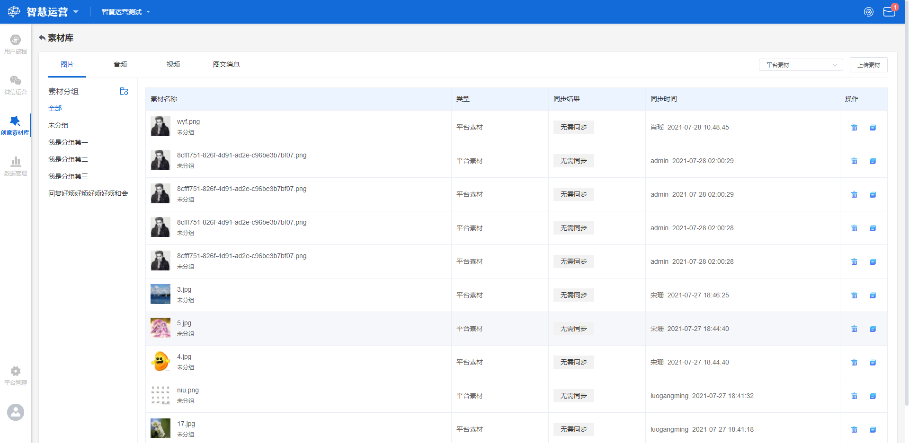
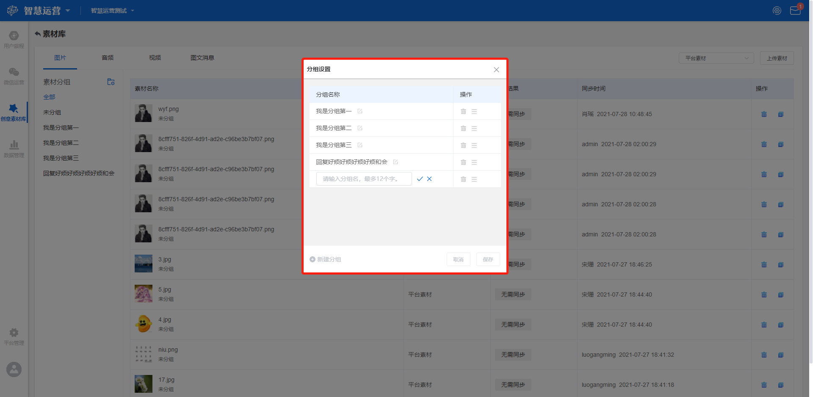
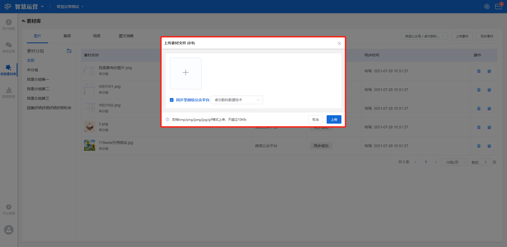

# 素材库

## 功能描述

支持上传平台素材、同步微信公众号素材至本地，为创意库提供素材支撑。

素材库主要在以下场景中使用：

* 在创意中作为基础素材使用；
* 在用户旅程中使用；
* 在微信运营中使用。

## 素材库界面概览

点击工作台左侧功能导航区**创意素材库**按钮，进入创意素材库界面，在该界面右上角点击**素材库**按钮，进入素材库界面。

素材库包含四种素材类型，图片、音频、视频和图文消息，界面分Tab显示各类型的素材列表，包括素材名称、类型、同步结果、同步时间和操作等标签。

其中图片支持素材分组、上传素材和同步素材，音频、视频和图文消息仅支持同步素材。

## 图片素材

点击素材库界面**图片**Tab，进入图片素材界面，支持**素材分组管理、上传素材和同步素材**功能。

### 素材分组

点击左侧分组信息栏素材分组右边的按钮，显示分组设置弹窗，点击左下角**新建分组**按钮新建素材分组，输入分组名称，点击右侧 :heavy_check_mark: 按钮保存该分组设置，点击 :heavy_multiplication_x: 则不保存。

新建的分组将在分组列表中显示，列表中支持编辑、删除和拖曳操作。

> 编辑：对当前分组名称进行编辑修改；
>
> 删除：删除此分组；
>
> 拖曳：可拖曳改变该分组的位置。

### 上传素材

点击左侧分组信息选择本次上传的素材需要在的分组，在列表右上角下拉框选择平台素材或微信公众号（备选项为所有经授权的公众号名称），两种类型均支持上传素材，点击下拉框右侧**上传素材**按钮，显示上传素材弹窗。

点击 :heavy_plus_sign: 按钮进入文件选择器，选择需要上传的本地图片，图片将出现在待上传阵列，鼠标在图片处悬停，会出现删除按钮，点击可将该图片移出待上传阵列。


上传图片时，允许多选，一次最多允许选择9张，支持bmp/png/jpeg/jpg/gif格式，每张图片大小不超过10Mb。


图片选择完成之后需选择是否勾选**同步至微信公众平台**，勾选则表示将所选图片上传至平台的同时也同步至微信公众号平台，需在下拉框选择公众号名称（备选项为所有经授权的公众号名称）；若不勾选，则表示仅将所选图片上传至平台，不同步至微信公众号平台。

选择完成之后点击**上传**按钮，开始上传图片，点击**取消**则不上传，返回原素材库界面。

### 同步素材

点击左侧分组信息选择本次同步素材需要在的分组，在列表右上角下拉框选择微信公众号（备选项为所有经授权的公众号名称），仅此类支持同步素材，点击右侧**同步素材**按钮，对所选公众号的图片素材进行同步。

## 音频/视频/图文消息素材

点击素材库界面**音频/视频/图文消息**Tab，进入音频/视频/图文消息界面，仅支持同步素材功能，同步方法同[图片素材-同步素材](material-library.md#tong-bu-su-cai)。

## 素材列表

上传或同步成功的素材均将在素材列表中展示，展示内容包括**素材名称、类型、同步结果、同步时间、操作**5个标签，各标签释义如下：

> 素材名称：上传或同步时的素材名称；
>
> 类型：包括平台素材和微信公众平台；
>
> 同步结果：素材同步的结果，包括无需同步和同步成功；
>
> 创建信息/同步时间：包含创建/同步该素材的账号名称和时间；
>
> 操作：可用操作包括删除和复制，可删除此条素材或者复制该素材链接。
