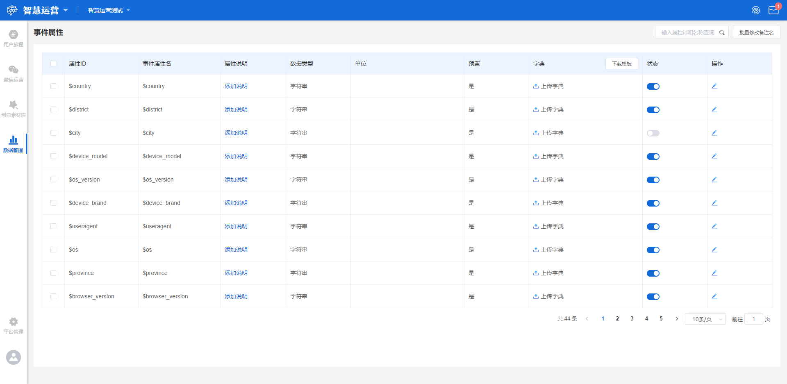
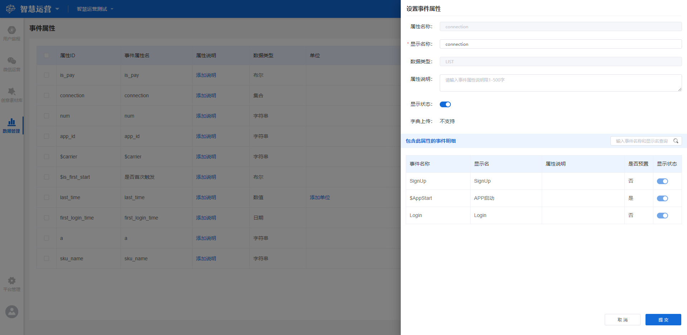

# 事件属性与用户属性

## 属性管理界面概览

事件属性管理与用户属性管理主要功能一致，在此处一同介绍。

属性管理面板分为两部分，分别为左侧的**导航功能区**和右侧的**展示功能区**，下面将以从进入事件属性或用户属性功能模块为起点，详细介绍各个标签代表的含义以及各功能的操作方法。

## 属性的概念

属性根据主体的不同分为**事件属性**和**用户属性。**

> **事件属性：**以事件为主体，与事件呈隶属关系，随事件上报过程一同上报。事件属性的丰富程度直接影响事件的数据体现质量，例如支付订单事件，常规会携带订单号，订单金额，商品名称等属性，如果不携带这些属性，那么我们就只能知道用户支付了一个订单，却不知道用户支付了什么，无法进行下钻分析；
>
> **用户属性：**以用户为主体，与用户呈隶属关系，主要用来丰富用户的数据形象，我们可以用标签的概念来理解用户属性，例如我们如果想要记住一个人，我们需要记住姓名，性别，年龄层次等基本属性，如果对这个人印象深刻，可能还会记住他的家乡，爱好等信息。可以说用户属性的丰富程度直接影响了用户洞察的准确程度。

## 进入事件属性管理

属性管理模块位于管理功能区内，可以在工作台左侧功能导航区点击**数据管理-元数据管理-事件属性或用户属性**。

## 界面各标签释义

属性管理界面中共存在**属性ID**，**属性显示名称**，**属性说明**，**数据类型**，**单位**，**预置**，**字典**，**状态**，**操作**9个标签，各标签的含义如下：

> 属性ID：该属性在数据库内的标识，根据《事件设计文档》制定，需要符合标准变量名命名规范，即只包含大小写字母，数字，下划线，且非预置属性不能以$符号开头；
>
>  属性显示名称：该属性用以展示的名称，可以根据实际的业务需求自定义名称。；
>
> 属性说明：根据实际需求为属性编写的说明；
>
> 数据类型：该属性字段的数据类型，共分为字符串类型，数值类型，日期事件类型，布尔类型，集合五种；
>
>  单位：标注该属性的单位，可以根据实际情况自定义单位；
>
> 预置：展示该属性是否为预置属性；
>
> 字典：对该属性字典的相关操作按钮；
>
>  状态：该属性的显示状态；
>
> 操作：该属性支持的操作，目前仅支持编辑。

## 属性显示名称的修改

### 单独修改

属性显示名称默认情况下与属性ID显示内容一致，可以点击属性显示名后的**编辑**按钮，对属性显示名称进行编辑修改，点击输入框外任意位置或键入回车键将保存修改后的属性显示名称。

### 批量修改

当属性数量较多时，可以选择对属性名进行批量修改，点击**批量修改备注名**按钮，将弹出批量修改备注名弹窗，只需两个步骤即可完成属性名批量修改：

#### 下载修改模板

点击**下载模板**按钮后，模板即开始下载，下载完成的模板文件名为【项目名称】-属性批量修改备注名模板.xlsx的表格文件，表格共分为三列，从左至右分别为属性ID，属性显示名称，属性说明。可以直接编辑属性显示名称与属性说明两列，编辑完成将文件保存在方便寻找的位置。


属性ID一列不可更改，更改后将导致批量修改失败。


#### 上传已修改模板文件

点击**上传文件**按钮后，将弹出本地文件选择窗口，找到刚才保存好的模板文件后点击右下角**打开**按钮进行上传。

以上两个步骤完成后，点击批量修改备注名弹窗右下角的**确定**按钮，即可完成批量修改属性名的操作。

## 属性说明的添加与修改

### 单独修改

项目在初始化状态时，属性说明处于未添加的状态，此时展示**添加说明**按钮，点击**添加说明**按钮后，将弹出属性说明编辑窗，在窗内输入想要添加的属性说明后，再点击右下角的确定按钮，即可保存添加好的属性说明。

对于已经添加完成的属性说明，点击属性说明右侧的编辑按钮，可以对其进行修改，修改完毕后点击右下角的确定按钮，即可保存。

### 批量修改

见上方属性显示名的批量修改过程。

## 添加与修改单位

点击属性后方的**添加单位**按钮，将弹出单位添加编辑窗口，在窗内输入想要添加的单位后，点击右下角的**确定**按钮，即可为该属性添加单位。

后续如需要对属性的单位进行修改，可点击单位旁的编辑按钮，对已经添加好的单位文本进行修改后，点击右下角的确定按钮即可。

## 字典功能

在一些企业中，数据在存储时不需要考虑后续的展示问题，例如将商品类型字段存储为phone，computer等值，这导致在数据接入后，数据的可视化不是很便利：


业务场景：电商企业需要分析最近1个月内，各品类成单数量的分布情况，此时如果商品类型存储为phone，computer这类的值，在数据结果查询完成后展示的结果可读性很差，分析人员往往需要将查询结果进行二次处理才能使用。


针对这类问题，可以使用字典功能将原来存储的值映射到一个新的值上，提升数据的可读性。

字典的本体为txt文件，一行一个映射关系，中间用**英文逗号**隔开，例如上方的phone与computer两个值，可以用字典映射为手机与电脑，格式如下：

phone,手机

computer,电脑

编写完成后，保存txt文件至方便寻找的位置，字典文件即创建完成。

### 添加字典

在项目处于初始状态时，属性未添加字典，此时所有属性后方的字典栏位全部展示**上传**按钮，点击上传按钮后，弹出本地文件选择窗口，选择保存好的字典文件，点击**打开**后，字典文件即可完成上传应用。

### 字典的相关操作

对于已经添加了字典的属性，在其字典栏位下将展示三个按钮，从左至右依次为**替换字典**，**下载字典**，**删除字典**：

#### 替换字典

点击**替换字典**后，将弹出字典替换窗口，如果此时本地已经有了编辑完成的字典文件，可以直接点击窗口中的**上传文件**按钮，选择需要替换的字典文件后点击**打开**按钮，即可完成字典的替换应用。

如果此时本地没有编辑完成的字典文件，可以先点击**点我下载**按钮，将之前上传的字典文件下载至本地，对其进行修改保存后，再点击**上传文件**按钮，选择保存完成的字典文件进行上传。

#### 下载字典

点击**下载字典**按钮后，之前上传的字典文件将被下载至本地。

#### 删除字典

为了防止误操作，在点击**删除字典**按钮后，将弹出删除的二次确认框，点击确认后，字典将被删除，且不可恢复。

## 属性的显示状态

在每一个属性的显示状态栏位下，都设有一个显示状态开关，开关共具有**开启**与**关闭**两种状态：


开启：该属性正常出现在所有模块的属性选择器中；

关闭：该属性从所有模块的属性选择器中隐藏。



属性显示状态的开启与关闭不影响该事件的数据采集，只影响其在属性选择器的显示状态。


## 属性的编辑

点击属性操作栏位下方的**编辑**按钮后，将从右侧展开属性的编辑窗口，该窗口的所有项目中，**属性ID**与**数据类型**不可修改，**属性显示名称**，**属性单位**，**属性说明**，**属性显示状态**四个项目可以修改，修改完成后点击右下角的确定按钮即可保存。

## 搜索

在属性管理界面上方设有搜索栏，可以在搜索栏中输入属性ID或属性显示名称进行搜索，搜索结果将实时展示在界面下方，当搜索无数据时界面展示暂无数据。

## 展示数量限制

默认情况下，属性管理界面每页展示10条属性，点击**单页展示数量切换**按钮，可以选择每页展示的属性数量。
