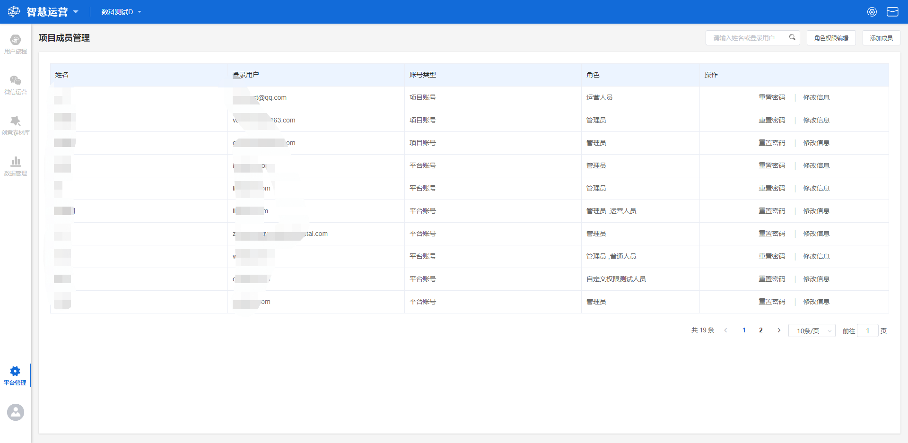

# 角色与权限

## 角色与权限界面概览

点击工作台左侧功能导航区**平台管理-角色与权限**按钮，进入角色与权限界面。

## 成员与角色的概念

在智慧运营工作台中，**成员**与**角色**的概念有所不同，我们可以用现实中**姓名**与**职位**的关系来理解成员与角色的区别：


成员：成员是独立的，每个成员分配一个账户，例如项目中的张某某，李某某。

角色：角色不是独立的，多个成员可以同属一个角色，例如管理员、运营人员。


在一个项目中，成员与角色的关系为项目>角色>成员。

通过**角色与权限**模块，管理员可以为不同成员进行角色赋予、权限配置等一系列操作，以便企业内部不同角色成员均参与到运营与决策的过程中来，同时也方便对所有项目成员进行统一的管理。

## 成员

### 成员账户类型的区别

智慧运营工作台的账户共有两种类型，分别是**平台账户**以及**项目账户**：

> 平台账户：拥有多个项目授权的账户称为平台账户。
>
> 项目账户：只拥有单项目授权的账户称为项目账户，一个项目账户获得除本项目外任一项目授权，则自动转化为平台账户。

### 为项目添加成员

管理员在为项目添加成员时，可以通过以下两种方法实现：

#### 新建账户

主要针对没有平台账号的用户。点击页面右上角**添加成员**按钮，选择**新建账户**，在新建账户弹窗中共有以下六个编辑项：

> 姓名：该成员的姓名；
>
> 登陆账号：登录账号需要为邮箱格式；
>
> 登陆密码：6-18位字符，由数字及字母组成；
>
> 角色：为此成员分配的角色，可单选或多选；
>
> 手机号：此成员的手机号码；
>
> 职务名称：此成员的职务名称。职务名称可以从已有职务中勾选或自行添加，添加职务后，该职务会在该项目中显示，若该成员还获得其他项目授权，在其他项目中不会显示该职务名称。

编辑完成后，点击**确定**按钮，即可在当前项目中创建一个新成员。

如果需要新建多个账户，可以在输入当前帐号信息后勾选**提交后，继续新增成员**复选框，点击确定后将立即开始创建下一个成员账户。

#### 邀请平台成员

选择邀请平台成员时，只能邀请该项目以外的成员，也就是已有平台账号，但未获得该项目授权的用户。点击页面右上角**添加成员**按钮，选择**邀请平台成员**，下拉寻找成员，或者输入名称、帐号查询到该用户，选择**邀请成员**，为其分配角色，选择职务名称，点击**确认**按钮即可。


新建账号时，若平台检测到该用户在其他项目中已有帐号，我们可直接邀请该成员加入本项目


## 成员的编辑操作

在项目所有成员列表页，我们可以根据需要对具体成员进行相关操作。

### 重置密码

若某一成员忘记密码或是想要更换密码，找到该成员，点击该成员右侧的**重置密码**按钮，输入新的密码，点击**确认重置**即可。

### 修改信息

点击某一成员右侧的**修改信息**按钮，可以重新设置该成员的**姓名，角色，手机号，职务**信息。

## 角色

### 预置角色

智慧运营工作台内部预置了常用的角色，不同角色对应不同的权限，管理员可以根据需要为不同的成员分配角色，各个预置角色的权限详情如下表所示：

| 模块      | 管理员 | 运营人员         | 普通人员    |
| ------- | --- | ------------ | ------- |
| 元数据管理   | √   | 仅元数据查看       | —       |
| 成员与权限   | √   | —            | —       |
| 用户旅程管理  | √   | 仅旅程列表查看和旅程管理 | 仅旅程列表查看 |
| 创意素材库   | √   | √            | —       |
| 全局触达限制  | √   | 仅全局触达查看      | —       |
| 触达通道管理  | √   | 仅触达通道查看      | —       |
| 微信服务号授权 | √   | 仅微信服务号授权查看   | —       |
| 粉丝列表    | √   | √            | —       |
| 被关注的回复  | √   | √            | —       |
| 收到消息回复  | √   | √            | —       |
| 关键词回复   | √   | √            | —       |
| 服务号模板消息 | √   | √            | —       |
| 服务号渠道码  | √   | √            | —       |

预置角色的权限配置无法修改。

### 新建角色

#### 直接新建角色

当预置角色的权限配置无法满足业务需求时，可以通过新建角色的方法个性化配置权限，点击权限编辑页面右上角**角色创建**按钮，输入新的角色名称，在权限列表中勾选需要授权的权限，而后点击**保存**按钮即可。

#### 复制已有角色权限

复制权限操作应用于创建**相似权限**的不同角色，例如某项目想要创建一个名为**数据运营**的自定义角色，其权限与**默认角色**中的**运营人员**权限相似，只少了一种权限，这种情况下可以直接进入**运营人员**的权限编辑页面，点击**复制权限**后，系统将自动勾选好相同的权限，管理员将其中一项权限取消，再重新命名即可，避免手动重复勾选。

## 角色成员管理

在一个项目中，同一**角色**下可能包含多个**成员**，我们可以通过角色成员管理功能，管理某个角色下的成员。

### 搜索角色

若要搜索具体角色下的某个用户，在搜索框内输入该用户姓名或账号后键入回车，展示界面将实时展示搜索后得到的结果。

### 添加成员

若要在某个具体角色下为其添加成员，点击右上角的**添加成员**按钮，勾选想要添加的成员名前的复选框，点击**提交**按钮即可。

通过此方式为某个角色添加成员时，可同时选择多个成员进行添加。

### 移至其他组

若在使用过程中，因为业务等原因需要对某一成员进行角色调整，找到该成员，点击**移至其他组**，选择新的角色，点击**确定移至**按钮即可。例如某成员在该项目中原本是运营角色，但工作需要将其转变成管理员角色，获取更多权限，我们就可以点击移至其他组，将该成员转化成管理员即可。

### 移出角色组

若在使用过程中，需要将某一成员从某个角色下删除，找到该成员，点击**移出角色组**，确认即可。


当一个成员只有一个角色的情况下，将此成员从角色成员列表中移除时，此成员会变更为普通成员，使用权限较少。

