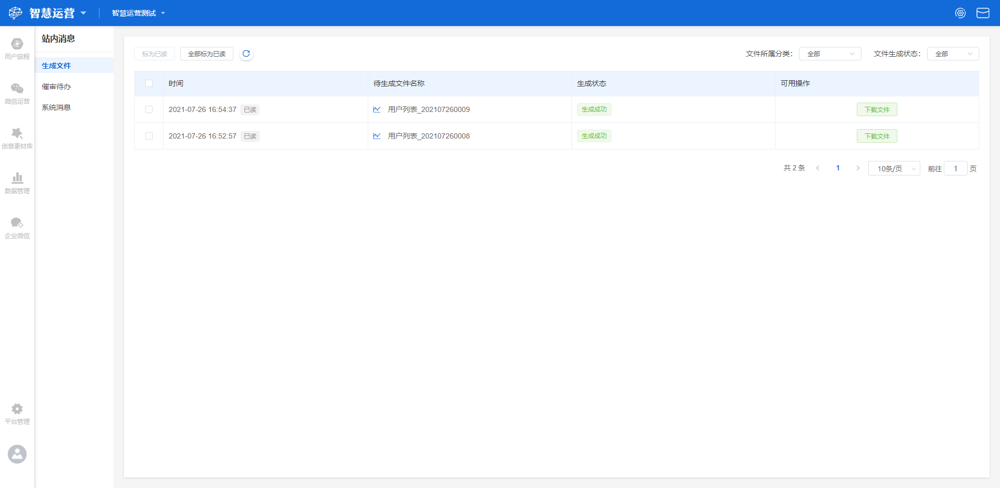
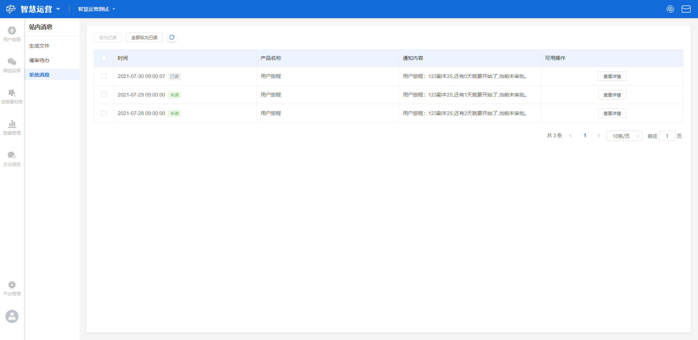

# 站内消息

站内消息位于工作台顶部菜单右侧，点击 :envelope: 按钮进入站内消息界面。站内消息包括**生成文件、催审代办、系统消息**三个界面。

## 生成文件

点击站内消息界面左侧导航栏**生成文件**按钮，进入生成文件界面。界面显示所生成文件的列表，列表内容包括**时间、待生成文件名称、生成状态、可用操作**。

> 时间：文件开始生成的时间点，精确至秒；
>
> 待生成文件名称：待生成文件的名称，由系统自动命名；
>
> 生成状态：包含正在生成、生成失败、生成成功三种；
>
> 可用操作：支持文件下载操作。

列表界面支持选中一条或多条信息标为已读、全部标为已读和刷新操作，同时支持按文件所属分类和文件生成状态筛选相关文件。

## 催审代办

点击站内消息界面左侧导航栏**催审代办**按钮，进入催审代办界面。界面显示用户旅程催促审批的消息列表，列表内容包括**时间、旅程名称、催审人、可用操作**。

> 时间：催审人点击催审的时间点，精确至秒；
>
> 旅程名称：催促审批的旅程的名称；
>
> 催审人：申请催审的账号名称；
>
> 可用操作：支持查看详情操作，点击按钮则进入用户旅程效果分析界面，可点击**审批通过**或**审批驳回**按钮对该旅程进行审批。

列表界面支持选中一条或多条信息标为已读、全部标为已读和刷新操作。


注意，催审代办界面仅管理员账号可显示，其他权限账号不显示此界面。


## 系统消息

点击站内消息界面左侧导航栏**系统消息**按钮，进入系统消息界面。界面显示所收到的系统消息列表，列表内容包括**时间、产品名称、通知内容、可用操作**。

> 时间：收到系统消息的时间，精确至秒；
>
> 产品名称：收到消息所涉及到的功能模块名称，比如用户旅程、微信运营等；
>
> 通知内容：所收到消息的内容；
>
> 可用操作：支持查看详情操作，点击按钮进入相应功能模块界面，针对消息内容进行相应操作。

列表界面支持选中一条或多条信息标为已读、全部标为已读和刷新操作。
