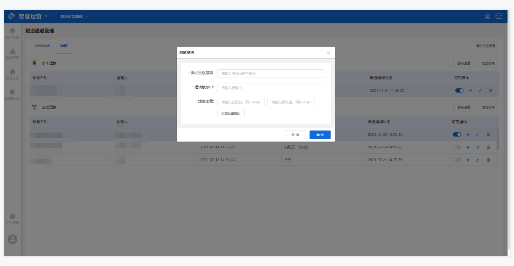

# 触达通道配置

## 功能描述

触达通道配置是用于对运营策略中给用户发送消息的方式和通道进行配置和管理的模块，可按照不同的触达方式进行配置，目前支持webhook和短信两种触达方式。

## 触达通道管理界面概览

触达通道配置位于设置中心，可在工作台顶部菜单栏右侧点击**设置中心-触达通道配置**，进入**触达通道配置管理**界面。

管理主界面分别显示webhook和短信两种触达方式，可点击名称切换。webhook管理列表根据创建时间降序排列，显示webhook名称、创建人、创建时间、最近编辑人、最近编辑时间、可用操作；短信管理界面按不同通道显示列表，列表根据创建时间降序排列，显示账号名称、创建人、创建时间、最近编辑人、最近编辑时间和可用操作。

## webhook

### 创建webhook

点击**创建webhook**按钮进入编辑界面，开始创建新的webhook。

在创建webhook界面添加**webhook名称**，该名称可根据不同的运营策略自定义，且该名称将在[创意素材库新建webhook文本类型的创意](../creativity-material-library/creativity-library.md#webhook-wen-ben)时以通道名称显示。

然后添加**请求地址和发送ID**，这里的请求地址为数据接收地址，例如自研或第三方的推送、优惠券系统。发送ID为给用户发送消息时的发送标识，如手机号、用户ID等。

#### 添加用户属性

在创建webhook时可以添加**用户属性**，包括参数名称、属性参数和默认值。用户属性中的所有内容，将在[创意素材库新建webhook文本类型的创意](../creativity-material-library/creativity-library.md#webhook-wen-ben)时组成表单的内容。

> 参数名称：用户属性的名称，可自定义，限英文；
>
> 属性参数：备选项为智慧运营平台用户属性中的属性名，无需另外赋值，直接在平台用户属性中自动获取；
>
> 默认值：当该用户属性值为空时的替换值。


例如，选择添加用户属性会员等级，可设置参数名称为vip level，选择属性参数为用户属性中的属性名“会员等级”，设置默认值“会员”，则发送消息时将显示钻石会员或黄金会员或普通会员，当属性值为空时，则显示会员。


可点击**增加用户属性**按钮，增加一组属性输入选择项，添加上限20个；也可点击**删除**按钮，将对应的用户属性输入选择项移除。

#### 添加模板参数

模板参数包括参数名称、显示名称和参数类型，设置之后可根据不同参数类型存储不同数据格式的内容。模板参数中的所有内容，也将在[创意素材库新建webhook文本类型的创意](../creativity-material-library/creativity-library.md#webhook-wen-ben)时组成表单的内容。

> 参数名称：模板参数的名称，可自定义，限英文；
>
> 显示名称：模板参数的显示名称，可自定义，新建webhook文本类型创意时用作表单的标题显示；
>
> 参数类型：备选项包括字符串、文本、日期、图片、数值-小数、数值-整数、数值-百分比，决定表单的输入形态。


模板参数需要另外赋值，在触达通道中配置好以后，需要在[创意素材库新建创意](../creativity-material-library/creativity-library.md#xin-jian-chuang-yi)时对其进行赋值。


可点击**增加模板参数**按钮，增加一组模板参数输入选择项，添加上限20个；也可点击**删除**按钮，将对应的模板参数输入选择项移除。

设置完成之后可点击**保存**按钮，将保存当前设置，并在webhook管理列表中显示；也可点击**取消**按钮，不保存当前设置，返回原触达通道管理界面。

### webhook可用操作

在webhook管理列表右侧的可用操作区，支持**改变状态、测试发送、编辑和删除**操作。

#### 改变状态

点击**改变状态**按钮可选择该条webhook通道的开启和停用，蓝色为开启状态，灰色为停用。开启状态可以正常使用该通道，停用状态则不可使用。


注意，当该条webhook通道正在被某个运营策略使用时则不能停用。


#### 测试发送

点击**测试发送**按钮可进入测试发送页面，填写完表单中所有参数后点击**确定**按钮，可测试是否能成功收到该条信息。该表单中所有参数均为必填项。

在该页面需填写发送ID和通道中设置的不同类型模板参数的值。

> 发送ID：填写测试发送时接收消息的用户属性的值，如设置通道时选择发送ID为手机号，则此处填写需要接收测试信息的手机号码，允许输入中文、英文、数字、符号；
>
> 文本类参数：输入文本类的内容，并支持插入用户属性，允许输入中文、英文、数字、符号；
>
> 字符串类参数：允许输入中文、英文、数字、符号；
>
> 数值类参数：只允许输入数值，分为整数、小数和百分比类型，根据不同的类型进行小数点后输入的约束；
>
> 日期类参数：在时间选择器中选择，可精确至分钟；
>
> 图片类参数：点击选择图片素材，弹出创意素材选择器，对图片进行选择。

#### 编辑

点击**编辑**按钮进入编辑页面，可对该条webhook通道进行编辑和修改。


注意，如果该条webhook通道正在被某个运营策略使用，则不能编辑和修改。


#### 删除

点击删除按钮，可以删除该条webhook通道。


注意，如果该条webhook通道正在被某个运营策略使用，则不能被删除。


## 短信

### 增加短信通道

点击**增加短信通道**按钮，显示增加短信通道编辑弹窗，添加**选择通道**和**通道显示名**，点击**确定**按钮，保存当前设置，且将在管理列表中显示新的短信通道；点击**取消**按钮，不保存当前设置，返回原短信通道管理界面。

> 选择通道：备选项为智慧运营平台已对接成功的短信通道；
>
> 通道显示名：该通道显示的名称，可自定义，但不能与其他通道显示名重复。

可点击该短信通道列表右上角**删除通道**按钮，删除此短信通道。

### 增加账号

点击短信通道列表右上角**增加账号**按钮，显示该短信通道下创建账号弹窗，可针对不同短信通道创建新的账号。填写完表单中所有参数后点击**确定**按钮，可保存所设置的内容，新建的账号将在该短信通道管理列表中显示；点击**取消**按钮，不保存当前设置，返回原短信通道管理界面。

不同短信通道所展现的表单内容不一样，但都包括账号相关信息和选择发送ID。

> 账号相关信息：在该短信通道购买账号时所涉及的相关信息，例如账号名称、数据接收地址、AppID、AppKey、账号、密码等。
>
> 选择发送ID：选择用户手机号对应的属性。

### 短信通道可用操作

在各短信通道管理列表右侧的可用操作区，支持**改变状态、测试发送、编辑和删除**操作。

#### 改变状态

点击**改变状态**按钮可选择该短信账号的开启和停用，蓝色为开启状态，灰色为停用。开启状态可以正常使用该账号，停用状态则不可使用。


注意，当该账号正在被某个运营策略使用时则不能停用。


#### 测试发送

点击**测试发送**按钮可进入测试发送页面，填写完表单中所有参数后点击**确定**按钮，可测试是否能成功收到该条信息。

不同短信通道所展现的表单内容不同，但都包括测试发送号码和短信模板相关内容。

> 测试发送号码：填写测试发送时接收消息的手机号码；
>
> 短信模板相关内容：短信模板根据不同的通道分为有模板ID和无模板ID两种。当有模板ID时，填写对应的短信模板ID，并添加变量名称和当该变量值为空时的替代值（默认值）；当无模板ID时，直接将对应的短信模板内容复制到短信模板栏，可在变量处插入属性。

#### 编辑

点击**编辑**按钮进入编辑页面，可对该短信账号进行编辑和修改。

#### 删除

点击删除按钮，可以删除该短信账号。


注意，如果该短信账号正在被某个运营策略使用，则不能被删除。

