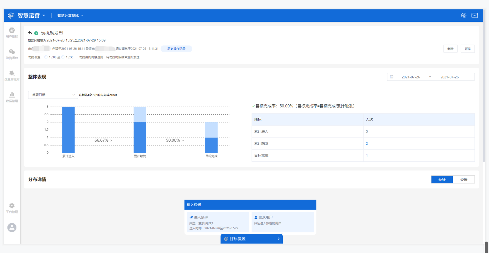

# 旅程效果分析

## 功能描述

用户旅程上线之后，对旅程进行实时追踪，包括该旅程指标的整体表现和各旅程节点的指标表现。

## 旅程效果分析界面概览

在用户旅程管理列表中点击**旅程名称**，进入旅程效果分析页面。该页面主要包括：**基本信息、整体表现、分布详情**三部分。

## 基本信息

此部分位于旅程效果分析界面最上面一部分，主要显示该旅程的基本信息，包括旅程名称、旅程类型、进入时间、创建人、创建时间、历史操作、勿扰设置详情。

## 整体表现

此部分位于旅程效果分析界面的中间部分，主要用于评估该用户旅程指标的整体表现，显示的分析指标主要包括：**累计进入人次、累计触发人次、目标完成人次、成功触达率、目标完成率**。

### 各指标释义

> 累计进入人次：各旅程节点的累计进入人次之和；
>
> 累计触发人次：各旅程节点的累计触发人次之和；
>
> 目标完成人次：各旅程节点的目标完成人次之和；
>
> 成功触达率：累计触发人次/累计进入人次；
>
> 目标完成率：目标完成人次/累计触发人次。

### 支持的操作

支持筛选日期范围，通过时间选择器进行筛选，查看选定日期范围内的指标表现，包括整体表现和分布详情。

支持首要目标和次要目标筛选，在下拉框进行选择，切换展示首要目标或次要目标的完成情况。

累计触发和目标完成支持**查看用户画像、查看用户列表、保存用户分群、下载用户列表**操作，鼠标在人次数值处悬停点击相应操作即可。

> 查看用户画像：跳转至CDP用户画像界面；
>
> 查看用户列表：跳转至CDP用户列表；
>
> 保存用户分群：保存该用户分群，需自定义输入分群名称；
>
> 下载用户列表：下载为Excel格式的文件，点击之后选择文件中需要展示的用户属性字段，点击确定即开始生成文件，可点击工作台右上角消息按钮查看进度和下载。

## 分布详情

此部分位于旅程效果分析界面的最下部分，点击**统计**按钮可进入分布详情分析界面，主要用于评估各旅程节点的指标表现，显示的分析指标主要包括：**累计进入人次、累计触发人次、目标完成人次、目标完成率**。

### 各指标释义

> 累计进入人次：满足旅程节点的筛选条件或触发事件进入该节点的用户人次；
>
> 累计触发人次：进入该旅程节点的实际发送的用户人次；
>
> 目标完成人次：实际发送的用户里完成目标的人次；
>
> 目标完成率：目标完成人次/累计触发人次。

### 支持的操作

支持查看设置操作，点击该旅程节点进入查看设置页面，显示累计进入人次、累计触发人次、目标完成人次以及该旅程节点的设置详情信息。


目前分布详情仅支持显示首要目标完成情况。

