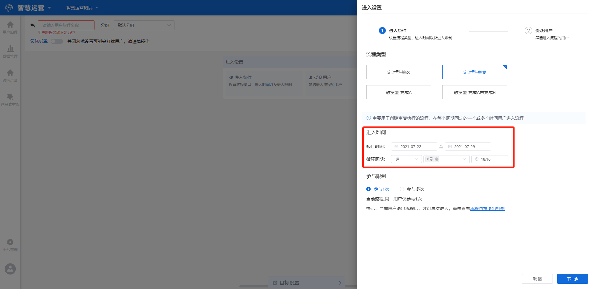
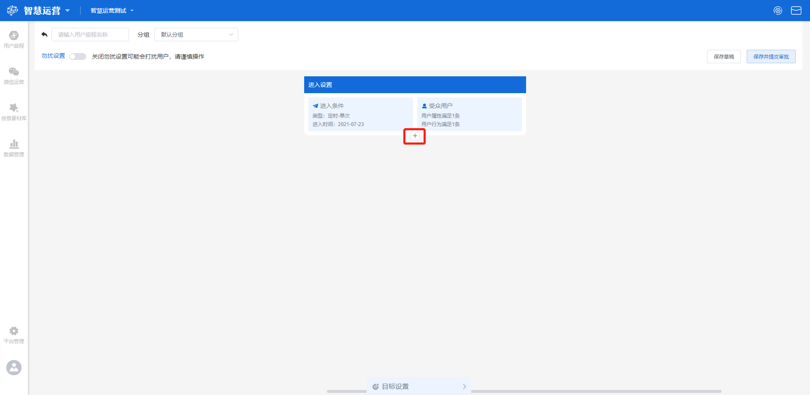

# 新建用户旅程

## 功能描述

用户旅程主要用于帮助运营人员创建复杂的运营流程，通过筛选符合条件的用户，在设置的时间点或者满足触发条件后进入用户旅程，然后基于用户筛选条件或触发事件分流，配置不同的运营策略。可基于实际运营场景在用户旅程里配置多个运营策略，待上线后自动执行，从而实现对不同人群的精细化运营或者对用户进行持续的运营。

创建一个新的用户旅程，主要包括**进入设置-进入条件**、**进入设置-受众用户**、**添加旅程节点**、**目标设置**、**勿扰设置**等流程。

## 场景举例

### 会员运营

#### 场景

> 活动主题：会员体系增益运营-双十一预热；
>
> 目标受众：青铜卡、白银卡、黄金卡会员；
>
> 运营策略：基于用户会员等级，推送不同价格区间商品，针对价格区间，推送满减优惠券；
>
> 活动效果评估：短信推送后，追踪目标受众60分钟内支付订单的完成率。

#### 如何实现

> 进入条件：选择旅程类型为定时型-单次，设置用户进入的时间为 2021－11－08 上午 10:00；
>
> 受众用户：会员等级-有值；
>
> 运营策略一：基于不同会员等级，将对应不同价格区间的商品通过短信推送的方式触达用户，添加三个旅程节点：青铜/白银/黄金卡会员活动推送；
>
> 运营策略二：优惠券触达，按用户筛选条件：会员等级进行分流；
>
> 运营策略三：加入购物车后触达，按事件：用户在2小时内做过加入购物车分流；
>
> 目标设置：首要目标设置为用户进入旅程 60分钟内完成支付订单。

### 微信粉丝待支付转化

#### 场景

> 活动主题：促进待支付微信粉丝付费转化；
>
> 目标受众：提交订单但未支付成功的用户；
>
> 运营策略：给提交订单但未支付的用户发送待支付提醒和支付即将超时提醒；
>
> 活动效果评估：接到待支付提醒通知后10分钟内完成支付订单数。

#### 如何实现

> 进入设置：选择流程类型为触发型-完成A但未完成B，设置用户进入的时间为 2021－06－30上午 10:00至2021－07－21上午 10:00期间内用户完成订单提交但未完成支付；
>
> 受众用户：提交订单但未支付成功的用户；
>
> 运营策略一：用户提交订单后5分钟之内通过短信通知用户尚未完成订单支付；
>
> 运营策略二：距离订单失效5分钟时通过短信通知用户订单即将失效；
>
> 目标设置：首要目标设置为进入旅程后10分钟内完成支付订单数。

## 新建用户旅程流程

### 分组管理

在新建用户旅程之前，可先对用户旅程分组进行管理，点击用户旅程界面右上角**分组管理**按钮，显示分组设置弹窗，目前支持新建分组、编辑已有分组、删除已有分组操作。

#### 新建分组

有两处位置可以新建用户旅程分组，一处在**分组设置弹窗**右下角点击**新建分组**按钮，另一处在**新建用户旅程-分组**下拉框点击**新建分组**按钮。

在新建分组编辑框内输入分组名称，该名称为自定义，点击**确认**保存当前设置，该分组名称将在分组设置列表中显示；点击**取消**不保存当前设置，返回原分组设置弹窗。


注意，分组名称不可重复。


#### 编辑已有分组

在分组设置弹窗列表中点击**编辑**按钮，进入编辑状态，可对该分组名称进行编辑修改，点击**确认**保存当前修改，点击**取消**不保存修改，返回原分组设置弹窗列表。

#### 删除已有分组

在分组设置弹窗列表操作栏点击**删除**按钮，可删除当前分组。


删除分组后，该分组的数据将移至默认分组。


### 进入设置-进入条件

该步骤主要用于设置旅程类型、进入时间和参与限制。

在用户旅程界面右上角点击**新建用户旅程**按钮进入设置页面，在左上角编辑框内添加旅程名称，该名称为自定义，并在分组下拉框选择相应的分组。

点击**进入设置-进入条件**按钮，打开进入条件设置页面，分别对**旅程类型**、**进入时间**和**参与限制**进行设定。

#### 旅程类型

目前包含四种旅程类型，包括**定时型-单次、定时型-重复、触发型-完成A、触发型-完成A未完成B**，可根据具体的运营场景进行选择。

> 定时型-单次：主要用于创建单次执行的旅程，用户在固定的时间进入旅程；
>
> 定时型-重复：主要用于创建重复执行的旅程，用户在每个周期固定的一个或多个时间进入旅程；
>
> 触发型-完成A：主要用于创建基于用户行为触发的旅程，当用户完成某个行为后进入旅程；
>
> 触发型-完成A未完成B：主要用于创建基于用户行为触发的旅程，当用户完成某个行为后一段时间内未完成另外一个行为时进入旅程。

#### 进入时间

不同类型旅程的进入时间设置方式不一样。

#### 1、进入时间（定时型-单次）

通过时间选择器设置用户进入旅程的时间，可精确至分钟。


注意，只能选择单个时间，且选择的时间不可晚于当前时间。


#### 2、进入时间（定时型-重复）

定时型-重复类型的用户旅程，进入时间需要设置用户进入旅程的**起止时间**和**循环周期。**

通过时间选择器设置用户进入旅程的起止时间，可精确至天。


注意，结束时间段不得小于起始时间段，起始时间段不得小于当前时间。


目前循环周期包含三种模式，每日、每周、每月，用于设定在每个周期固定的一个或多个时间对满足条件的用户进行触发。

> 每日：支持设定每日某一时间节点对满足条件的用户进行触发，精确至分钟；
>
> 每周：支持设定每周不同天内的同一时间节点对满足条件的用户进行触发，精确至分钟；
>
> 每月：支持设定每月不同日期相同的时间节点对满足条件的用户进行触发，精确至分钟。

#### 3、进入时间（触发型-完成A）

触发型-完成A类型的用户旅程，进入时间需要设置用户完成事件A的时间段和触发事件。

通过时间选择器设置完成事件A的时间段，可精确至分钟。


注意，结束时间段不得小于起始时间段，起始时间段不得小于当前时间。


通过选择下拉框中的元事件设置触发事件，当用户在规定时间段内完成触发事件后进入旅程。


支持添加多个事件，各事件之间为或的关系；

支持添加多个筛选条件，针对所选事件携带的属性进行筛选，与元事件为且的关系，各筛选条件之间为或或者且的关系（非必选项）。


#### 4、进入时间（触发型-完成A未完成B）

触发型-完成A未完成B类型的用户旅程，进入时间需设置完成事件A的时间段、未完成事件B的时间范围、事件A和事件B。

通过时间选择器设置完成事件A的时间段，可精确至分钟。


注意，结束时间段不得小于起始时间段，起始时间段不得小于当前时间。


通过选择完成A事件后的下拉框中的元事件设置触发事件A，表示用户在规定时间段内完成了触发事件A。


支持添加多个事件，各事件之间为或的关系；

支持添加多个筛选条件，针对所选事件携带的属性进行筛选，与元事件为且的关系，各筛选条件之间为或或者且的关系（非必选项）。


未完成事件B的时间范围限制，可通过下拉框选择不同的三种类型，分钟、小时、天，通过增加和减少按钮设置相应时间范围的值。

通过选择未完成B事件后的下拉框中的元事件设置触发事件B，当用户在设定的时间段内完成了事件A但在一定时间范围内未完成事件B时进入用户旅程。


支持添加多个事件，各事件之间为或的关系；

支持添加多个筛选条件，针对所选事件携带的属性进行筛选，与元事件为且的关系，各筛选条件之间为或或者且的关系（非必选项）。


.png>)

#### 参与限制

定时型-重复、触发型-完成A、触发型-完成A未完成B类型的用户旅程需要设置参与限制，可通过点击选择参与1次或参与多次。

> 参与1次：对于当前旅程，同一用户仅能参与1次；
>
> 参与多次：对于当前旅程，可自定义同一用户在多少天内最多参与的次数。


当选择参与多次时，当前用户只有退出旅程后，才可再次进入，点击查看[用户旅程退出机制](user-journey-exit-mechanism.md)。


设置完成之后点击**下一步**，保存当前设置并进入下一步骤，如点击**取消**则不保存，返回原用户旅程设置页面。

### 进入设置-受众用户

进入设置-受众用户是进入设置的第2个步骤，主要用来对进入该旅程的用户进行用户属性和用户行为属性的条件筛选，此两大属性可以是且或者或的关系相互切换，以满足更加个性化的条件筛选。

进入条件设置完成之后，点击**下一步**则进入受众用户编辑页面。

#### 用户属性满足

针对用户属性进行条件筛选，可以基于用户属性、用户分群和用户标签添加规则来筛选用户，支持添加多条规则，多条规则之间可以是“且”“或”的任意组合。

#### 用户行为满足

针对用户行为进行条件筛选，可以基于用户在过去一段时间里做过行为的总次数、分布或者行为属性添加规则，也可以基于用户在过去一段时间里未做过的行为添加规则，支持添加多条规则，多条规则之间可以是“且”“或”的任意组合。

#### 受众预估

预估筛选出的用户数量，会按照各个有效的触达通道分别统计推送ID/电话号码/发送ID不为空的用户数，显示预估触达人数和预估触达比例。


预估触达比例=对应触达通道的预估触达人数/预估触达人数总和。


设置完成之后点击**保存**，保存当前设置，点击**取消**则不保存，返回原用户旅程设置页面。


注意，不同类型用户旅程的受众用户设置方式一样，但定时型-单次和定时型-重复类型的受众用户设置为必选项，触发型-完成A和触发型-完成A未完成B为非必选项，可以选择不设置。


### 添加旅程节点

该步骤主要用于对进入用户旅程的用户进行分流并实施不同的运营计划，主要分为三种不同的类型，包括**按用户筛选条件分流、按触发事件分流和其他型**。


一个用户旅程里可以添加多级旅程节点，同一级旅程节点可以添加多个。

同一用户一次只能进入一个旅程节点，当一个用户满足同一父级下的多个旅程节点进入条件时时，按从左到右的顺序决定该用户进入哪个节点。


点击 :heavy_plus_sign: 按钮可进入添加旅程节点编辑页面，在旅程节点编辑框内添加节点名称，该名称为自定义。

在旅程节点类型处通过点击选择不同的节点类型，包括**按用户筛选条件分流**和**按触发事件分流**。


注意，请仔细确认首个旅程节点类型，同一父级旅程节点下只能添加同类型的节点或其他型节点。


#### 旅程节点类型-按用户筛选条件分流

由**用户筛选、延时设置、触达消息**三部分组成，满足用户筛选条件的用户进入该旅程节点。

> 用户筛选：可以对受众用户进行二次过滤，筛选方法和维度同[受众用户](set-new-user-journey.md#jin-ru-she-zhi-shou-zhong-yong-hu)，但此处为选填项，可以不添加任何条件；
>
> 延时设置：此处可选择满足用户筛选条件则立即/延迟/不发送消息；延迟支持三种类型，包括分钟、小时和天，即可以选择对满足用户筛选条件的用户延迟相应时间再发送消息；
>
> 触达消息：此处需要选择触达通道和配置发送内容，触达通道的可选项来源于已经配置好的触达通道列表，如需修改或添加，可在[触达通道配置](../set-center/reach-channel-configuration.md)处进行配置。发送内容模板可选项来源于创意素材库已配置好的创意内容，同时可以点击**添加webhook创意模板**/**添加短信创意模板**/**添加公众号创意模板进入**创意素材库进行添加。


对于短信和webhook两种触达方式，此处可以选择是否开启全局触达限制，关闭则不限制，开启则按照当前节点中使用通道的限制进行限制，如果需要修改限制条件，需前往[全局触达限制](../set-center/overall-reach-limit.md)页面修改。


#### 旅程节点类型-按触发事件分流

由**触发事件、延时设置、触达消息**三部分组成，满足触发事件的用户进入该旅程节点。

> 触发事件：基于用户在一段时间内（可选择分钟/小时/天）做过或未做过触发事件进行实时匹配，筛选规则同[进入时间-触发型-完成A](set-new-user-journey.md#3-jin-ru-shi-jian-chu-fa-xing-wan-cheng-a)中触发事件的设置；
>
> 延时设置：可以选择对满足触发事件的用户立即或者延迟一段时间进行发送，设置规则同[旅程节点类型-按用户筛选条件分流](set-new-user-journey.md#lv-cheng-jie-dian-lei-xing-an-yong-hu-shai-xuan-tiao-jian-fen-liu)
>
> 触达消息：选择配置通道和配置发送内容，设置规则同[旅程节点类型-按用户筛选条件分流](set-new-user-journey.md#lv-cheng-jie-dian-lei-xing-an-yong-hu-shai-xuan-tiao-jian-fen-liu)

设置完成之后点击**确定**按钮，保存当前设置，且该节点将在用户旅程页面显示；点击**取消**按钮，不保存当前设置，返回原用户旅程页面。

在用户旅程页面进入设置下方点击下图中按钮，可添加其他型旅程节点。

#### 旅程节点类型-其他型

由**延时设置、触达消息**两部分组成，在同一父级旅程节点下，当用户均不满足其他节点条件时进入其他型节点。


延时设置和触达消息的设置均同[旅程节点类型-按用户筛选条件分流](set-new-user-journey.md#lv-cheng-jie-dian-lei-xing-an-yong-hu-shai-xuan-tiao-jian-fen-liu)



注意，同一父级旅程节点最多只能添加一个其他型旅程节点，且不能单独存在。


.png>)

创建多个旅程节点并保存之后，所有旅程节点都将在用户旅程界面显示，且可在该界面对各级旅程节点进行如下操作：

> 删除：点击旅程节点右上角删除按钮，可删除当前旅程节点；
>
> 连线：点击旅程节点下方连线按钮，将该旅程节点与下一级旅程节点产生链接，则两个旅程节点变为父级和子集旅程节点的关系；
>
> 添加：点击 :heavy_plus_sign: 按钮，可在该旅程节点下添加子旅程节点。

### 目标设置

#### 设置流程

目标设置主要用于评估用户旅程中运营策略的效果，支持设置首要目标和次要目标，并监控旅程中目标的达成情况。

点击用户旅程页面底部**目标设置-点击前往设置目标**按钮，进入目标设置页面。

此处可以点击**是否设置目标**按钮选择是否设置目标。灰色为关闭目标设置，则不会追踪目标完成情况，仅按照用户旅程的设置进行发送；蓝色为开启目标设置，进入目标设置页面。


此处可设置首要目标和次要目标，如果打开目标设置，则必须设置一个首要目标，次要目标为选填项，可以不设置，最多可设置三个。


首要目标和次要目标的设置方式相同，均需设置**目标窗口期**和**目标转化事件**，即设置用户进入旅程之后，在一段时间（目标窗口期）之内完成了相应的转化事件（目标转化事件），则认为完成目标。

> 目标窗口期：可选择分钟/小时/天；
>
> 目标转化事件：下拉框选择，备选项为[数据管理](../data-management/)中所设计的元事件。可点击右侧**增加筛选**按钮，对目标转化事件增加筛选条件，针对事件属性进行筛选，可同时添加多条筛选条件，各条件之间为“或”“且”任意切换的关系。


注意，设置的目标窗口期尽量覆盖旅程节点的延时和触发事件的窗口期，否则即使完成目标事件也不会计入目标转化。


设置完成之后点击**确定**按钮，保存当前设置，且目标设置情况将在用户旅程界面目标设置处显示；点击**取消**按钮，不保存当前设置，返回原用户旅程页面。

### 勿扰设置

可针对当前用户旅程对用户进行勿扰设置，点击用户旅程页面左上角**勿扰设置**按钮，选择是否开启勿扰设置。灰色为关闭，不设置勿扰时间段；蓝色为开启，进入勿扰设置编辑状态，主要对勿扰时间段和勿扰期间的动作进行设置。

> 勿扰时间段：通过时间选择器设置勿扰时间段，可精确至分钟；
>
> 勿扰期间的动作：在下拉框选择勿扰期间的动作，包括放弃本次触达和待勿扰时段结束立即发送。

设置完成之后，可点击用户旅程页面右上角**保存草稿**或**保存并提交审批**按钮，将保存当前设置。

> 保存草稿：该用户旅程将在用户旅程管理列表中显示，状态为草稿；
>
> 保存并提交审批：该用户旅程将在用户旅程管理列表中显示，状态为审批中，等待管理员审批。
