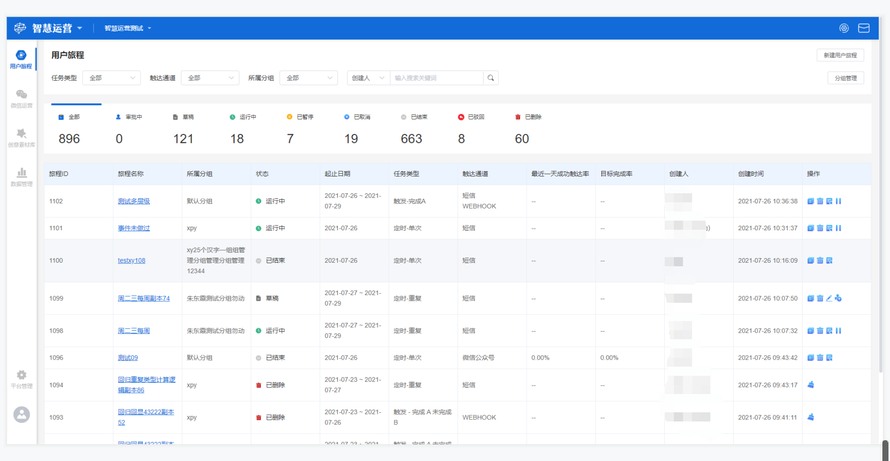

# 用户旅程管理

## 功能描述

用来展示用户旅程列表，对用户旅程进行统计、筛选、编辑、删除、查看等操作的功能模块。

## 用户旅程管理界面概览

点击工作台左侧功能导航区**用户旅程**按钮，进入用户旅程管理界面。

## 界面各标签释义

用户旅程管理界面支持按任务类型、触达通道、所属分组下拉框选择筛选，支持按创建人或旅程名称输入关键词搜索筛选，同时按照不同状态对用户旅程进行数量统计和筛选。

用户旅程管理列表共存在**旅程ID、旅程名称、所属分组、状态、起止日期、任务类型、触达通道、最近一天成功触达率、目标完成率、创建人、创建时间、操作**12个标签，各标签的释义如下：

> 旅程ID：该用户旅程的标识，在创建过程中按创建顺序由系统自动分配；
>
> 旅程名称：创建用户旅程时自定义的名称；
>
> 所属分组：创建用户旅程时设置的分组名称；
>
> 状态：该条旅程目前所属的状态，包括以下8种：草稿、审批中、运行中、已暂停、已取消、已结束、已驳回、已删除；
>
> 起止日期：创建用户旅程时设置的进入时间；
>
> 任务类型：创建用户旅程时选择的旅程类型，包括定时型-单次、定时型-重复、触发型-完成A、触发型-完成A未完成B；
>
> 触达通道：创建用户旅程时选择的触达用户的通道；
>
> 最近一天成功触达率：累计触发人次/累计进入人次，对于进行中的旅程统计当天的触达率；对于已经结束的旅程，统计结束当天的触达率；
>
> 目标完成率：目标完成人次/累计触发人次；
>
> 创建人：创建该用户旅程的账户名称；
>
> 创建时间：该用户旅程创建完成保存的时间点；
>
> 操作：该用户旅程支持的操作，不同旅程状态支持的操作不同。

## 用户旅程各状态释义

用户旅程主要包含以下8种不同的状态，**草稿、审批中、运行中、已暂停、已取消、已结束、已驳回、已删除**，各状态的具体释义如下：

> 草稿：创建完旅程，选择保存草稿而非保存并提交审批时的状态；
>
> 审批中：包含两种情况，创建的旅程提交之后，等待审批的状态，或暂停中的旅程重新启动，等待重新审批的状态；
>
> 运行中：创建的旅程通过审批之后进入运行中，包括旅程尚未开始执行和旅程已经开始执行，尚未结束两种情况；
>
> 已暂停：旅程由待审批中或运行中转入暂停状态；
>
> 已取消：旅程由审批中转入取消状态；
>
> 已结束：等到最后一次触发之后进入已结束，包括两种情况，旅程从运行中转入已结束状态，即旅程执行完毕，或者旅程从审批中或已暂停转入已结束状态，即旅程已过期；
>
> 已驳回：旅程审批未通过被驳回的状态；
>
> 已删除：旅程被删除不再显示的状态。

## 用户旅程各状态支持的操作

用户旅程处于不同的状态，支持的操作不同，详情如下表：

| 旅程状态 | 列表页支持的操作         | 详情页支持的操作                     |
| ---- | ---------------- | ---------------------------- |
| 草稿   | 复制、编辑、提交审批、删除    | 提交审批、编辑、删除                   |
| 审批中  | 复制、查看、删除、取消、催审   | 催审、删除、取消、审批通过（仅管理员）、驳回（仅管理员） |
| 运行中  | 复制、查看、暂停、删除      | 暂停、删除、                       |
| 已暂停  | 复制、查看、启动、删除、编辑   | 启动、删除、编辑                     |
| 已结束  | 复制、删除、查看         | 删除                           |
| 已删除  | 无                | 无                            |
| 已驳回  | 复制、查看、编辑、删除、提交审批 | 编辑、删除                        |
| 已取消  | 复制、删除、查看         | 删除                           |


复制操作为复制当前旅程，并自动创建该旅程的副本，进入草稿状态。

