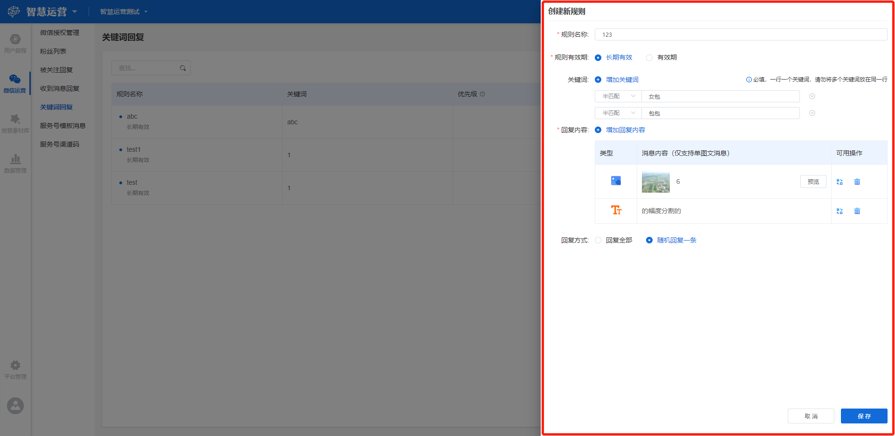

# 自动回复

## 功能描述

用于设定在公众号内自动回复的规则，以达到与用户的实时互动、促进用户留存的目的。包括**被关注回复、收到消息回复和关键词回复**三种类型。

## 被关注回复

被关注回复指用户关注公众号时自动收到提前设置好的回复内容。

### 被关注回复界面概览

点击工作台左侧功能导航区**微信运营-被关注回复**按钮，进入被关注回复界面。

界面显示公众号基础数据区和回复配置区。

基础数据区包括**同步数据**按钮，点击即可同步当前公众号的数据，同时显示上次同步时间和该管理员今天剩余同步次数（一个管理员一天可同步3次），可通过右侧下拉框选择目前需要设置的公众号名称（备选项为所有经过授权的公众号名称），显示该公众号昨日新增粉丝、昨日取关粉丝、昨日累计总粉丝等统计数据。

回复配置区主要用来配置回复内容，列表显示已配置好的素材创意，包括类型、消息内容和可用操作。

### 回复配置

点击**被关注自动回复**按钮，可选择开启或者关闭自动回复，蓝色为开启，此状态下，当公众号被关注时根据回复方式的配置进行消息发送；灰色为关闭，则不进行消息发送。

#### 回复方式

当选择被关注自动回复为开启状态时，需要配置回复内容。首先需要设置回复方式，包括**回复全部**和**随机一条回复**两种。

> 回复全部：回复列表中设置好的所有消息内容；
>
> 随机一条回复：在列表随机选择一条进行回复。

#### 回复内容

点击回复内容列表右上角**增加被关注回复内容**按钮，进入创意素材选择器，选择已经设置好的素材创意作为回复内容，具体设置方法和规则见[创意素材库](../creativity-material-library/)_。_

选择的素材创意将在回复内容列表中展现，包括**类型、消息内容、可用操作**三个标签，各标签释义如下：

> 类型：所选择素材创意的类型，包括8种：图片、音频、视频、图文、外部链接、纯文字、小程序、会话菜单；
>
> 消息内容：所选择素材创意的名称，支持预览，点击**预览**按钮即可预览详情；
>
> 可用操作：针对本条回复内容支持的操作，包括**替换**和**删除**。点击**替换**按钮跳转至素材创意选择器，重新选择回复内容；点击**删除**按钮将本条回复内容删除。

## 收到消息回复

收到消息回复指用户给公众号发送任何类型的消息，未触发其他回复规则，则自动回复此处设置的回复内容。

### 收到消息回复界面概览

点击工作台左侧功能导航区**微信运营-收到消息回复**按钮，进入收到消息回复界面。

界面主要显示回复配置区，用来配置回复内容，列表显示已配置好的素材创意，包括类型、消息内容和可用操作。

可在右上角下拉框选择目前需要设置的公众号名称（备选项为所有经过授权的公众号名称），选择后，列表内容刷新，展示该公众号下设置的回复内容。

### 回复配置

回复配置包括收到消息自动回复的开启/关闭、回复方式、回复内容增加、替换与删除，操作流程和规则同[被关注回复-回复配置](automatic-response.md#hui-fu-pei-zhi)

## 关键词回复

关键词回复指用户给公众号发送消息，如果触发了提前设置好的关键词规则，则自动回复此处设置的回复内容。

### 关键词回复界面概览

点击工作台左侧功能导航区**微信运营-关键词回复**按钮，进入关键词回复界面。

界面主要显示已配置好的规则列表，包括规则名称、关键词、优先级、回复内容、可用操作等标签。

可在界面右上角下拉框选择目前需要设置的公众号名称（备选项为所有经过授权的公众号名称），选择后，列表内容刷新，展示该公众号下设置的回复规则。

在列表左上角支持输入关键词搜索相应的规则。

### 回复规则和内容配置

#### 配置方法

点击列表右上角**创建新规则**按钮，进入关键词回复配置页面。创建一个新的回复规则需要设置如下内容，**规则名称、规则有效期、关键词、回复内容、回复方式**，详情如下：

> 规则名称：所创建规则的名称，为自定义；
>
> 规则有效期：包括长期有效和设置有效期两种选择。选择有效期按钮，则显示时间设置框，通过时间选择器选择该规则的开始和结束日期，精确至秒；
>
> 关键词：在编辑框输入需要设置的关键词，下拉框选择匹配方式，包括半匹配和全匹配（半匹配指用户发送的消息包含关键词，全匹配指用户发送的消息与关键词完全吻合）。可点击**增加关键词**按钮增加一组关键词输入项，也可点击右侧**删除**按钮删除该组关键词输入项；
>
> 回复内容：点击**增加回复内容**按钮，进入创意素材选择器，选择已经设置好的素材创意作为回复内容。同一规则可选择多条回复内容；
>
> 回复方式：包括回复全部和随机回复一条两种类型，释义同[被关注回复-回复配置-回复方式](automatic-response.md#hui-fu-fang-shi)。


注意，设置关键词时，一行仅填写一个关键词，请勿将多个关键词放在同一行。


#### 列表标签释义

规则配置完成后点击**保存**按钮，保存当前设置，该规则将在规则列表中显示，包括**规则名称、关键词、优先级、回复内容、可用操作**5个标签，各标签的释义如下：

> 规则名称：创建规则时设置的名称，此处还显示规则有效期；
>
> 关键词：创建规则时设置的所有关键词；
>
> 优先级：该条规则回复的优先级；
>
> 回复内容：创建规则时选择的回复内容，此处显示回复内容的类型和数量；
>
> 可用操作：该条规则支持的操作。包括改变状态、改变优先级、编辑和删除。


注意，优先级设置的数字越小，优先级越高。


#### 可用操作释义

列表中可用操作包括**改变状态、改变优先级、编辑和删除**，具体释义如下：

> 改变状态：选择该规则开启或停用，蓝色为开启，开启后该规则将生效；灰色为停用，停用后将无法使用该规则回复；
>
> 改变优先级：设置该规则的优先级。规则创建完成时默认优先级为5，可在此处重新设置；
>
> 编辑：对该条规则编辑修改；
>
> 删除：删除该条规则。

## 自动回复优先级规则

当用户向公众号发送消息时，按如下优先级规则选择回复内容进行回复：


当用户发送的消息包含多个规则设置的关键词，则按优先级顺序使用优先级最高的规则进行回复；

当多个规则优先级一致时，用创建时间最靠近当前时间的规则进行回复。

