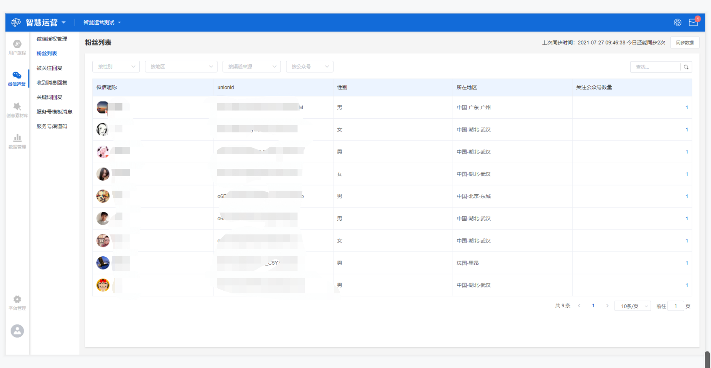
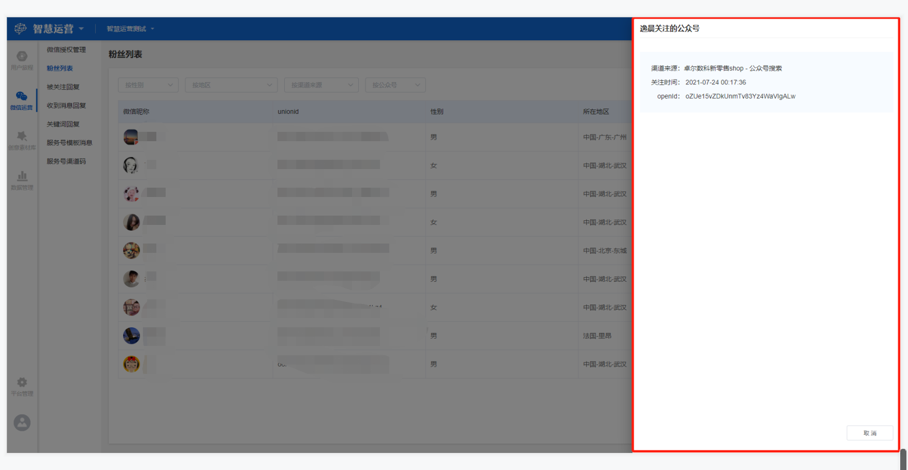

# 粉丝列表

## 功能描述

支持同步微信公众号的粉丝列表，可实时监测公众号的粉丝数据，可实现同一用户关注多个该微信开放平台下公众号的统一管理。

## 粉丝列表界面概览

点击工作台左侧功能导航区**微信运营-粉丝列表**按钮，进入粉丝列表界面。

界面显示同步数据按钮、筛选和搜索区域、粉丝列表。

## 粉丝列表

粉丝列表主要展示所有授权公众号的粉丝，包含**微信昵称、unionid、性别、所在地区、关注公众号数量**5个标签，各标签释义如下：

> 微信昵称：该粉丝在微信的用户昵称；
>
> unionid：用户的标识，对同一微信开放平台账号下的不同应用唯一，只有将公众号绑定到微信开放平台帐号后，才会出现该字段；
>
> 性别：该粉丝的性别；
>
> 所在地区：该粉丝所在的地区，包含国家-省-市；
>
> 关注公众号数量：该粉丝关注的同一微信开放平台下的所有公众号的数量。

## 可用操作

### 筛选和搜索

支持按性别、地区、渠道来源、公众号名称进行筛选，在粉丝列表上方的下拉框选择即可，同时可输入关键词搜索，展示于粉丝列表右上方。

### 同步数据

点击界面右上角**同步数据**按钮，可获得最新的粉丝列表，同时在按钮左侧显示上次同步时间和该管理员今日还能同步的次数。


一个管理员，每天可以同步3次。（微信开放平台默认给每个账号提供了每天100次的同步次数，这里的3次指分配给每个管理员的每日同步次数）


### 查看用户关注公众号

点击粉丝列表关注公众号数量下方的数值，将会展现该粉丝关注的公众号页面，显示渠道来源、关注时间和openID。

> 渠道来源：该粉丝关注此公众号的渠道来源，包括公众号搜索、公众号迁移、名片分享、扫描二维码、图文页内名称点击、图文页右上角菜单、支付后关注、微信广告、其他；
>
> 关注时间：关注该公众号的时间点；
>
> openId：用户的标识，对当前公众号唯一。


注意，这里显示的公众号仅为该粉丝关注的同一微信开放平台下的公众号。


