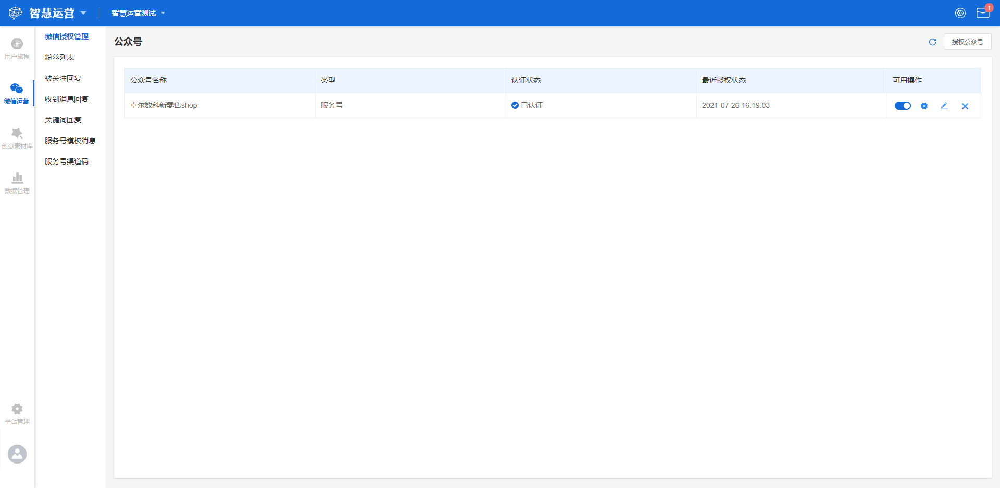
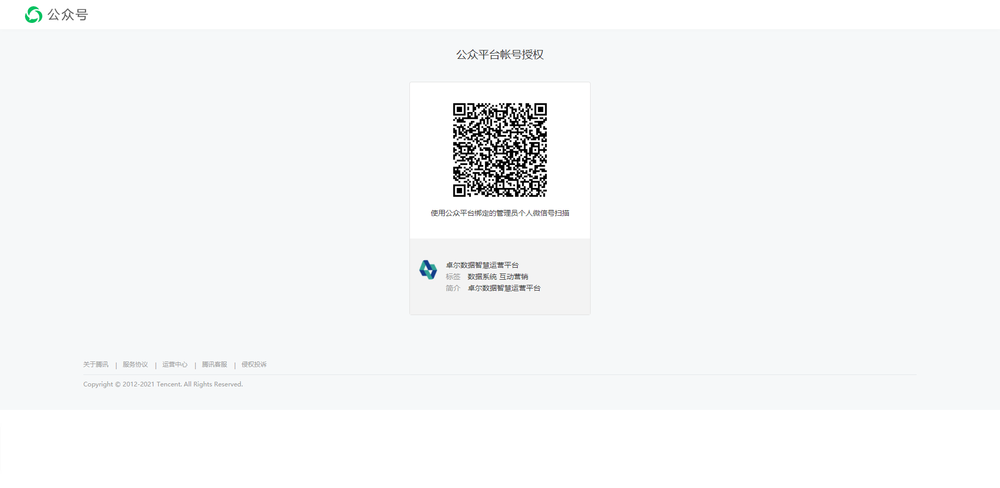

# 微信授权管理

## 功能描述

提供微信公众号授权管理的功能，用于对微信公众号与本平台绑定的授权和管理。

## 微信授权管理界面概览

点击工作台左侧功能导航区**微信运营-微信授权管理**按钮，进入微信授权管理界面。

界面显示授权列表、刷新、授权公众号按钮。

## 授权公众号

点击微信授权管理界面右上角**授权公众号**按钮，跳转至微信开放平台授权页，请使用微信公众号管理员账号扫码，开始确认授权。授权成功后列表中将出现该公众号的记录。

点击右上角**刷新**按钮，可获取目前最新的授权公众号列表与授权权限。

## 授权列表

授权列表展示经授权通过的公众号，按授权成功时间降序排列，共存在**公众号名称、类型、认证状态、最近授权状态、可用操作**5个标签，各标签的释义如下：

> 公众号名称：经授权通过的公众号的名称；
>
> 类型：公众号的类型，包括服务号、订阅号，目前仅支持服务号；
>
> 认证状态：该公众号的认证状态，包括已认证、未认证、已过期；
>
> 最近授权状态：公众号与平台绑定的授权状态，包括成功授权、授权失败；
>
> 可用操作：对于该公众号支持的操作，包括更改状态、设置OpenId、更改授权、取消授权。


注意，列表中的认证状态不是指平台与微信公众号的认证绑定状态，是指公众号的微信认证状态。


### 可用操作释义

> 更改状态：点击按钮选择开启/停用该公众号，停用后，公众号运营界面此公众号将不可选，但来自此公众号的粉丝在粉丝列表中依旧可见；
>
> 设置OpenId：开启服务号之前请先设置 OpenID，选择当前公众号 OpenID 对应的属性字段；
>
> 更改授权：点击跳转至微信开放平台对授权进行更改；
>
> 取消授权：点击**取消授权-开始解除**按钮时，跳转至微信开放平台进行授权取消。


注意，取消授权后，与该公众号相关的所有数据将不作保留。

