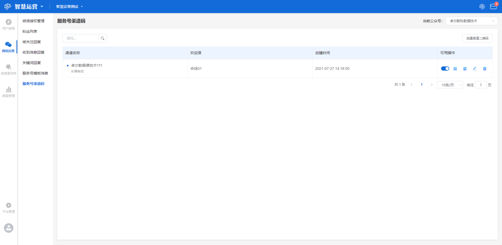
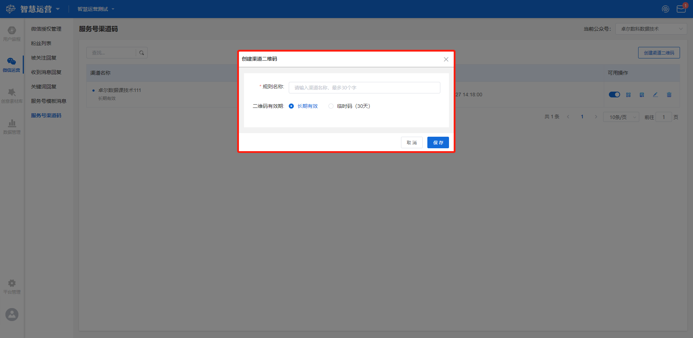
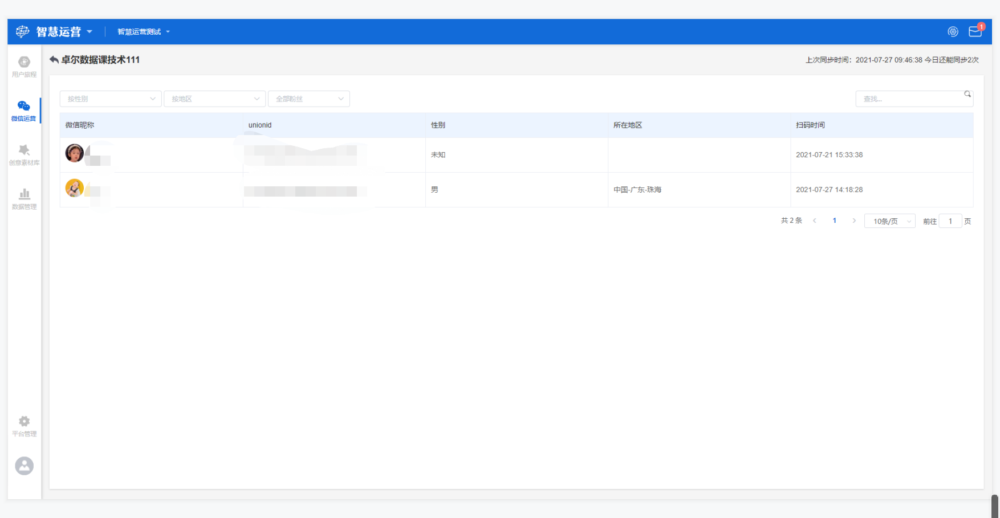

# 服务号渠道码

## 功能描述

通过创建不同的渠道二维码，监控不同渠道的用户来源情况，同时设定欢迎语，达到与用户的实时互动、促进用户留存的目的。

## 服务号渠道码界面概览

点击工作台左侧功能导航区**微信运营-服务号渠道码**按钮，进入服务号渠道码界面。

界面主要显示创建的渠道二维码列表，包括渠道名称、欢迎语、创建时间、可用操作等标签。

可在右上角下拉框选择需要创建渠道二维码的公众号名称（备选项为所有经过授权的公众号名称）。本界面还支持输入关键词搜索相应的渠道码。

## 创建渠道二维码

点击列表右上角**创建渠道二维码**按钮，显示创建二维码弹窗。创建二维码时需要设置**渠道名称和二维码有效期**。

> 渠道名称：设定用于区别其他渠道的名称，自定义；
>
> 二维码有效期：可选择长期有效和临时码，临时码有效期为30天。

创建完成后点击**保存**按钮，保存当前设置，创建的渠道码将在列表中显示；点击**取消**按钮，不保存当前设置。

### 列表标签释义

列表中显示**渠道名称、欢迎语、创建时间和可用操作**4个标签，各标签释义如下：

> 渠道名称：创建渠道二维码时设置的渠道名称；
>
> 欢迎语：[被关注回复](automatic-response.md#bei-guan-zhu-hui-fu)中设置的回复内容，此处显示名称；
>
> 创建时间：创建渠道二维码的时间点；
>
> 可用操作：该渠道二维码支持的操作，包括改变状态、下载二维码、查看粉丝、编辑、删除。

### 可用操作释义

列表中可用操作包括**改变状态、下载二维码、查看粉丝、编辑、删除**，各操作释义如下：

> 改变状态：蓝色为开启，开启后该二维码将生效；灰色为停用，停用后将无法使用该二维码；
>
> 下载二维码：支持下载该渠道二维码；
>
> 查看粉丝：点击该按钮，进入查看粉丝页面，显示通过扫描该二维码进来的粉丝列表。展示微信昵称、unionid、性别、所在地区、扫码时间等信息。支持按性别、按地区、按全部/新/老粉丝筛选，同时支持输入关键词搜索相关粉丝；
>
> 编辑：对该渠道二维码进行编辑；
>
> 删除：删除该渠道二维码。

