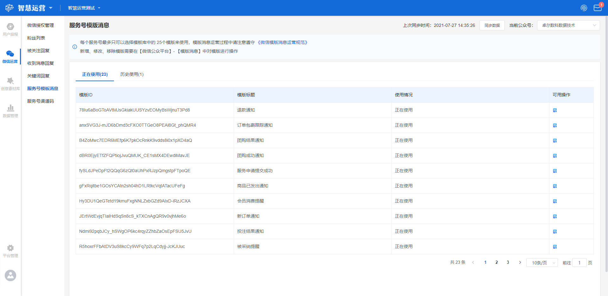

# 服务号模板消息

## 功能描述

支持同步微信公众号下的模板消息，实时了解公众号下模板消息数据，可在新建旅程节点时选择使用。

## 服务号模板消息界面概览

点击工作台左侧功能导航区**微信运营-服务号模板消息**按钮，进入服务号模板消息界面。

界面主要显示公众号下的模板消息列表，按正在使用和历史使用分开展示。显示信息包括模板ID、模板标题、使用情况（包括正在使用和历史使用）和可用操作（目前仅支持模板预览）。

可在右上角下拉框选择需要显示模板消息的公众号名称（备选项为所有经过授权的公众号名称），点击**同步数据**按钮，对消息列表进行刷新，同步该公众号下最新的模板消息，同时显示上次同步时间。


每个服务号最多只可以选择模板库中的 25个模板来使用，模板消息运营过程中请注意遵守 《微信模板消息运营规范》。

 新增、修改、移除模版需要在【微信公众平台】- 【模板消息】中对模板进行操作。


